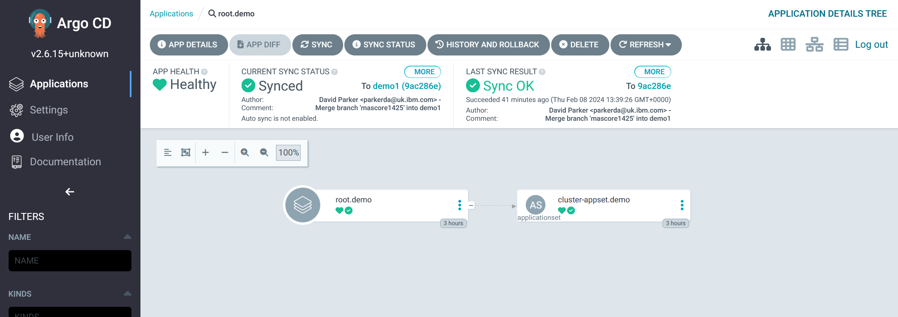

# Maximo Application Suite GitOps Demo

## Steps
1. Provision an OCP Cluster
2. Setup Secret Manager
3. Install & Configure ArgoCD
4. Create the MAS root application
5. ...


### 1. Provision an OCP Cluster
```bash
export IBMCLOUD_APIKEY=xxx
mas provision-roks -r mas-development -c gitopsdemo -v 4.12_openshift --worker-count 3 --worker-flavor b3c.16x64.300gb --worker-zone lon02 --no-confirm
```

### 2. Setup Secrets Manager
Set up [AWS Secrets Manager](https://us-east-2.console.aws.amazon.com/secretsmanager/listsecrets?region=us-east-2), and [create an access key](https://us-east-1.console.aws.amazon.com/iam/home#/security_credentials?section=IAM_credentials)


### 2. Run mas gitops-bootstrap
This will:
- Install ArgoCD operator
- Create ArgoCD instance
- Configure Secret Manager backend for ArgoCD
- Configure ArgoCD ServiceAccount and RBAC
- Enable the ArgoCD Vault plugin
- Configure ArgoCD authentication to your application repository using personal access token
- Patch `openshift-marketplace` and `kube-system` namespaces to allow ArgoCD to manage them
- Add `cluster-admin` access to openshift-gitops ServiceAccount (required for managing CecurityContextContraints)
- Create an ArgoCD project for Maximo Application Suite
- Create the Maximo Application Suite root ApplicationSet

```bash
SECRET_KEY=xxx
ACCESS_KEY=xxx
PAT=xxx

mas gitops-bootstrap \
  --account-id demo \
  --cluster-id d1 \
  --app-revision demo1 \
  --sm-aws-secret-region us-east-2 \
  --sm-aws-secret-key $SECRET_KEY \
  --sm-aws-access-key $ACCESS_KEY \
  --github-url https://github.com/ibm-mas/gitops-demo \
  --github-revision 001 \
  --github-pat $PAT
```
You will end up with the root application and a single ApplicationSet deployed in ArgoCD as below:


### 2. Run mas gitops-cluster
This will:
- Create a new secret in AWS Secrets Manager `demo/demo1/ibm_entitlement` holding the image pull secret for the IBM Container Registry (which contains your IBM entitlement key)
- Create a new secret in AWS Secrets Manager `demo/demo1/aws` holding the access token and secret token for AWS Secrets Manager, which is used by various ArgoCD sync hooks to make updates to secrets
- Generate three new application configuration files in the GitHub working directory:
    - `/demo/eu-gb/demo1/ibm-common-services.yaml`
    - `/demo/eu-gb/demo1/ibm-mas-cluster-base.yaml`
    - `/demo/eu-gb/demo1/ibm-operator-catalog.yaml`

```bash
mas gitops-cluster -d /home/david/ibm-mas/gitops-demo \
  --account-id demo \
  --region-id eu-gb \
  --cluster-id demo1 \
  --icr-username $USER \
  --icr-password $PASSWORD \
  --sm-aws-secret-region us-east-2 \
  --sm-aws-secret-key $SECRET_KEY \
  --sm-aws-access-key $ACCESS_KEY \
  --secrets-path $SM_PATH \
  --catalog-version v8-240130-amd64 \
  --catalog-image icr.io/cpopen/ibm-maximo-operator-catalog \
  --catalog-action install \
  --common-services-channel v3.23 \
  --common-services-action install
```

You must now push these changes to the branch specified when you bootstrapped ArgoCD (in this case `001`), and Sync the ArgoCD project.


## Useful Commands

### Secrets Manager: List All Secrets
```bash
aws secretsmanager list-secrets --output yaml --no-cli-pager | yq -r '.SecretList[].Name'
```
