# Maximo Application Suite GitOps Demonstration

The following is a step-by-step demonstration that you can work through to install MAS on AWS via GitOps using the Helm Charts in [ibm-mas/gitops](https://github.com/ibm-mas/gitops) and the MAS CLI. We recommend that you review the [ibm-mas-gitops README](https://github.com/ibm-mas/gitops) before following the steps in this demonstration. 

Please note:
- You do not *need* to use the MAS CLI to use our Helm Charts, but at this stage of development there is no documentation in place for this. 
- It is possible to use other cloud providers, but this has not been tested sufficiently for demonstration yet.
- It is possible for ArgoCD to run on one cluster, managing MAS instances across multiple other clusters. In the interests of simplicity, in this demonstration we will restrict the deployment to a single MAS Instance running in the same cluster as ArgoCD.
- For brevity, we only install the **Manage** MAS application here, but all of the MAS applications are supported.

The process boils down to the following steps:
  - Provision a ROSA cluster
  - Configure AWS Secrets Manager
  - Create a Git repository to hold your configuration files
  - Install and configure ArgoCD
  - Create the  **Account Root Application**
  - Install Mongo DB on the cluster
  - Create secrets in Secrets Manager and push config files to your Config Git repository

The final step is achieved here using various `gitops` functions provided by the MAS CLI. These have been structured primarily to suit IBM Internal processes. We would like to provide a more streamlined and generic CLI/utility to achieve this in future iterations.

### Prerequisites

 - An AWS Account with [ROSA](https://console.aws.amazon.com/rosa/home) support enabled.
 - An access key and secret access key for calling AWS Secrets manager (configure [here](https://us-east-1.console.aws.amazon.com/iam/home#/security_credentials?section=IAM_credentials)).
 - Docker (or equivalent) installed on your local machine (for running the MAS CLI image)
 - An IBM Entitlement Key. Access [Container Software Library](https://myibm.ibm.com/products-services/containerlibrary) using your IBMId to obtain your entitlement key.
 - A MAS License File. Access [IBM License Key Center](https://licensing.subscribenet.com/control/ibmr/login), on the **Get Keys** menu select **IBM AppPoint Suites**. Select `IBM MAXIMO APPLICATION SUITE AppPOINT LIC` and on the next page fill in the information as below:
    
    | Field            | Content                                                                       |
    | ---------------- | ----------------------------------------------------------------------------- |
    | Number of Keys   | How many AppPoints to assign to the license file                              |
    | Host ID Type     | Set to **Ethernet Address**                                                   |
    | Host ID          | Enter any 12 digit hexadecimal string                                         |
    | Hostname         | Set to the hostname of your OCP instance, but this can be any value really.   |
    | Port             | Set to **27000**                                                              |


### Start the MAS CLI image and mount the demo files

If you haven't already, clone this repository to your local machine. This is so we can mount some included configuration files into the MAS CLI container for use later.
```bash
GITOPS_DEMO_PATH=~/gitops-demo
git clone git@github.com:ibm-mas/gitops-demo --branch 002 ${GITOPS_DEMO_PATH}
```

Now run the version of the CLI image used in this demonstration, mounting the files from the gitops-demo repo as follows:

> TODO: update cli image version
```bash
docker run -v $GITOPS_DEMO_PATH/files:/demo-files -ti --pull always quay.io/ibmmas/cli:9.0.0-pre.gitops
```

### Setup common environment variables

The CLI allows arguments to be passed in both via command-line arguments and environment variables. For repeated parameters that are used by many of the functions that we are going to call, we are going to export them as environment variables so we don't have to specify them every time. Please customize the values in the script below, then run it in your mas-cli terminal session:

```bash

# This will determine the name of the top-level folder in your Git Config repo
# It will also be provided in the configuration of the Account Root Application
export ACCOUNT_ID="dev"

# This will determine second-level folder in your Git Config repo.
# It will also be included in the names of the Applications that ArgoCD will generate
# Must be less than 15 characters (see "Naming Length Restrictions" below)
export CLUSTER_ID="masdemo1"

# This will determine the OCP cluster that ArgoCD targets.
# In this tutorial, we are deploying a single MAS instance in the same cluster as ArgoCD.
export CLUSTER_URL="https://kubernetes.default.svc"

# This will determine third-level folder in your Git Config repo.
# It will also be included in the names of the Applications that ArgoCD will generate
# Must be less than 15 characters (see "Naming Length Restrictions" below)
export MAS_INSTANCE_ID="inst1"

# This will determine the name of the MAS Suite and Application workspace in your deployment
export MAS_WORKSPACE_ID="inst1ws1"
export MAS_WORKSPACE_NAME="Instance 1 Workspace 1"

# Details for access your AWS account and linked Redhat account.
# These will be used to provision the ROSA cluster and create a Document DB instance
export AWS_ACCESS_KEY_ID="xxx"
export AWS_SECRET_ACCESS_KEY="xxx"
export AWS_REGION="us-east-1"
export ROSA_TOKEN=xxx

# These will be used to configure the AVP plugin in ArgoCD so it is capable of retrieving secrets from AWS Secrets Manager
# They will also be used to configure various secrets automatically by some of the CLI functions we are about to call
# These can be the same as the AWS details above
export SM_AWS_REGION="${AWS_REGION}"
export SM_AWS_SECRET_ACCESS_KEY="${AWS_SECRET_ACCESS_KEY}"
export SM_AWS_ACCESS_KEY_ID="${AWS_ACCESS_KEY_ID}"

# This will be substituted into generated configuration .yaml files to reference secrets
# and allow them to be resolved by the AVP plugin when rendering Helm Charts
SM_AWS_ACCOUNT_ID="xxxxx"
export SECRETS_PATH="arn:aws:secretsmanager:${SM_AWS_REGION}:${SM_AWS_ACCOUNT_ID}:secret"


# TODO: this env var is expected by all the gitops functions, but none of them actually do anything with it. We should deprecate this.
# The only place we actually need this information is gitops-bootstrap to set source.revision on the account root app
# (and this set via the APP_REPO_REVISION env var)
export GITOPS_VERSION="<deprecated>"
```

> **Naming Length Restrictions** Because we stitch together the different IDs that form the hierarchy together we need to ensure that the total length is less than the 64 character limit of ArgoCD applications, to achieve this follow these restrictions when setting values for `--cluster-id` (`CLUSTER_ID`), and `--mas-instance-id` (`MAS_INSTANCE_ID`):
> - **Cluster ID**: 15 characters. Must be unique within an account.
> - **MAS instance ID**: 15 characters. Must be unique within a cluster.

### Provision a ROSA Cluster
```bash

mas gitops-rosa -c "${CLUSTER_ID}" --ocp-version 4.14.18 --rosa-compute-machine-type m5.4xlarge --rosa-compute-nodes 3
```

### Login to your ROSA Cluster
```yaml
# Obtain the credentials generated for your ROSA cluster
# These are held in a YAML file generated by the gitops-rosa command
ROSA_CLUSTER_DETAILS_YAML="/mascli/tmp-rosa/rosa-${CLUSTER_ID}-details.yaml"
ROSA_CLUSTER_API_URL="$(cat ${ROSA_CLUSTER_DETAILS_YAML} | /usr/bin/yq .data.api_url)"
ROSA_CLUSTER_ADMIN_USERNAME="$(cat ${ROSA_CLUSTER_DETAILS_YAML} | /usr/bin/yq .data.username)"
ROSA_CLUSTER_ADMIN_PASSWORD="$(cat ${ROSA_CLUSTER_DETAILS_YAML} | /usr/bin/yq .data.admin_password)"

# And login to the cluster
oc login "${ROSA_CLUSTER_API_URL}" --username "${ROSA_CLUSTER_ADMIN_USERNAME}" --password "${ROSA_CLUSTER_ADMIN_PASSWORD}" --insecure-skip-tls-verify
```


### Setup your Config Git Repo

You will need to set up your own **Config Git Repo** in your preferred provider and supply its details to the CLI via some environment variables. This is where ArgoCD will look for configuration files that define your MAS instance, and it is where the CLI will push configuration files to. Once you have setup the repository, in your MAS cli terminal session, run the following, replacing the values as appropriate.

```bash
export GITHUB_HOST="github.com"
export GITHUB_ORG="my-org"
export GITHUB_REPO="my-mas-gitops-repo"
export GIT_BRANCH="002"
export GIT_SSH="false"
```

Create a personal access token in your git provider, ensuring that it has sufficient permissions to read from and write to your **Config Git Repo**. Set it in your MAS cli terminal session environment as follows:
```bash
export GITHUB_PAT="xxx"
```

And configure git:
```bash
git config --global user.email "you@example.com"
```

### Bootstrap ArgoCD and create the Account Root Application
The `mas gitops-bootstrap` function will perform the following actions:
- Install ArgoCD operator
- Create ArgoCD instance
- Configure Secret Manager backend for ArgoCD
- Configure ArgoCD ServiceAccount and RBAC
- Enable the ArgoCD Vault plugin
- Configure ArgoCD authentication to your application repository using personal access token
- Patch `openshift-marketplace` and `kube-system` namespaces to allow ArgoCD to manage them
- Add `cluster-admin` access to openshift-gitops ServiceAccount (required for managing SecurityContextContraints)
- Create an ArgoCD project for Maximo Application Suite
- Create the Maximo Application Suite **Account Root Application**

```bash
mas gitops-bootstrap \
  --account-id "${ACCOUNT_ID}" \
  --app-revision demo2 \
  --sm-aws-secret-region "${SM_AWS_REGION}" \
  --sm-aws-secret-key "${SM_AWS_SECRET_ACCESS_KEY}" \
  --sm-aws-access-key "${SM_AWS_ACCESS_KEY_ID}" \
  --github-url "https://${GITHUB_HOST}/${GITHUB_ORG}/${GITHUB_REPO}" \
  --github-revision "${GIT_BRANCH}" \
  --github-pat "${GITHUB_PAT}"
```

Once complete, you should see a message in your terminal like:
```
ArgoCD is now available at https://openshift-gitops-server-openshift-gitops.apps.x.openshiftapps.com username is: admin and password: xxxx
```

You should now be able to access the ArgoCD Web UI. Open the URL in your browser, enter the username and password you see in the message above and hit **SIGN IN** (NOTE: do not click the **LOG IN VIA OPENSHIFT** button). You should see the **Account Root Application** in ArgoCD:

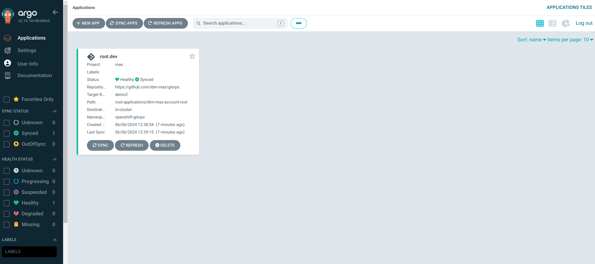

Click on the **Account Root Application**. This should have a single child: the **Cluster Root Application Set**. Since the **Account Root Application** is configured with an [Automated Sync Policy](https://argo-cd.readthedocs.io/en/stable/user-guide/auto_sync/), everything should either be in the process of syncing or be synced alredy.

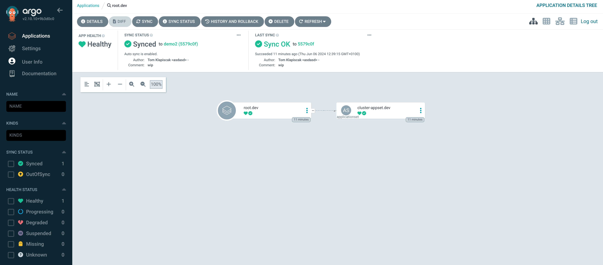

This is the only time we will directly make changes on the cluster, with the installation of the **Account Root Application** ArgoCD is ready to automatically deploy all necessary ArgoCD applications as you commit new configuration files to the GitHub configuration repository.


> If desired, you can safely proceed through the subsequent steps of this demonstration before waiting for the Applications created by each step to be synced and become healthy. This is possible since ArgoCD will take care of orchestrating the deployment, ensuring that sync for each application is triggered only once its prerequisites are healthy.

### Generate configuration for the Cluster Root Application
The `mas gitops-cluster` function will perform the following actions:
- Create a new secret in AWS Secrets Manager `${ACCOUNT_ID}/${CLUSTER_ID}/ibm_entitlement` holding the image pull secret for the IBM Container Registry (which contains your IBM entitlement key)
- Create a new secret in AWS Secrets Manager `${ACCOUNT_ID}/${CLUSTER_ID}/aws` holding the access token and secret token for AWS Secrets Manager, which is used by various ArgoCD sync hooks to make updates to secrets
- Generate four new configuration files and push them to your **Config Git Repo**:
    - `/${ACCOUNT_ID}/${CLUSTER_ID}/ibm-mas-cluster-base.yaml`
    - `/${ACCOUNT_ID}/${CLUSTER_ID}/ibm-mas-cluster-base.yaml`
    - `/${ACCOUNT_ID}/${CLUSTER_ID}/redhat-cert-manager.yaml`
- The post sync hook in the cert manager application will register two new secrets in AWS Secrets Manager:
    - `${ACCOUNT_ID}/${CLUSTER_ID/db2_default_channel`
    - `${ACCOUNT_ID}/${CLUSTER_ID/cluster_domain`


```bash
# These are used in the ibm_entitlement secret used to pull images from IBM Container Registry (ICR)
ICR_USERNAME="xxx"
ICR_PASSWORD="xxx"

mas gitops-cluster \
  --github-push \
  --cluster-url "${CLUSTER_URL}" \
  --icr-username "${ICR_USERNAME}" \
  --icr-password "${ICR_PASSWORD}" \
  --catalog-version v8-240430-amd64 \
  --catalog-image icr.io/cpopen/ibm-maximo-operator-catalog \
  --catalog-action install \
  --common-services-channel v3.23 \
  --common-services-action install
```

It will take a few minutes for the **Cluster Root Application Set** to see the new configuration files in your **Config Git Repo**. Once this happens, you will see a new **Cluster Root Application** appear as a child of the **Cluster Root Application Set**. It should begin syncing automatically, it will be in the "Progressing" state for a short while:

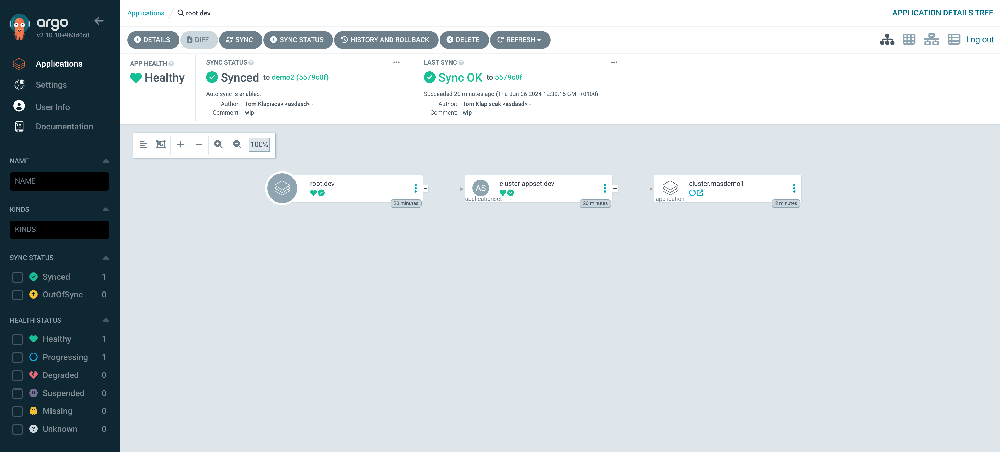

After a few minutes, it should transition to healthy:

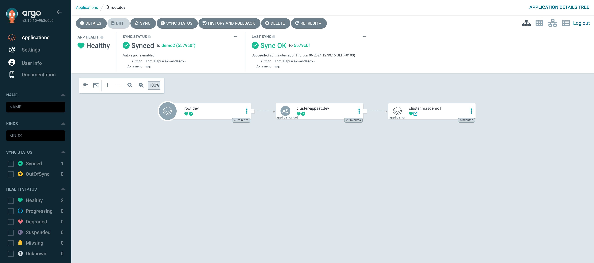

Open the **Cluster Root Application** by clicking on the **Open application** button indicated in the screenshot above, the **Operator Catalog**, **Redhat Cert Manager** applications and the **Instance Root Application Set** will be visible as children of the **Cluster Root Application** 

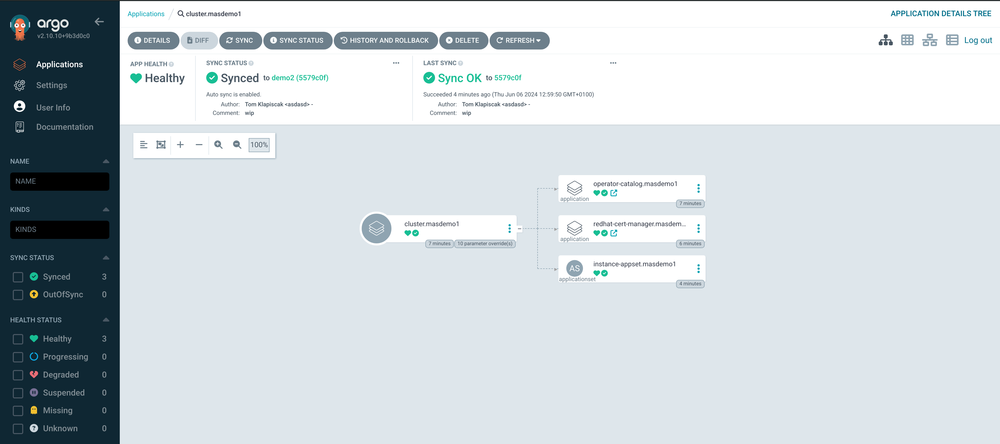


### Generate configuration for DRO
The `mas gitops-dro` function will generate one new configuration file in the GitHub working directory:
- `/${ACCOUNT_ID}/${CLUSTER_ID}/ibm-dro.yaml`

The post sync hook in ibm-dro will register a new secret in AWS Secrets Manager: `${ACCOUNT_ID}/${CLUSTER_ID/dro`

```bash
mas gitops-dro \
  --github-push
```

After a few minutes you should see two new applications appear as children of the cluster root application. The **DRO** application itself, along with a small "cleanup" application. The cleanup application contains an ArgoCD [PostDelete hook](https://argo-cd.readthedocs.io/en/stable/user-guide/resource_hooks/) necessary to ensure the **DRO** application is cleaned up properly when its config is deleted from the **Git Config Repo**.

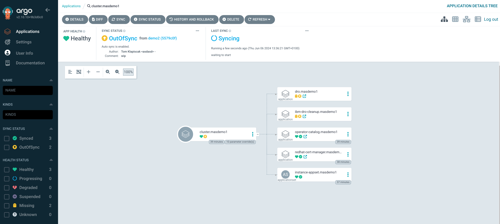

It should take less than 10 minutes for both of these application to reach Healthy/Synced status. If desired, you can safely proceed with the next steps of this demonstration before this happens.


### Generate configuration for the DB2U operator application
Later in this demonsration, we plan to install the Manage application in our MAS instance. Manage depends on a DB2 database, and we are going to deploy this database to our cluster. Before we do this, we must install the DB2U operator:

The `mas gitops-db2u` function will generate one new configuration file in the GitHub working directory:
- `/${ACCOUNT_ID}/${CLUSTER_ID}/ibm-db2u.yaml`


```bash
mas gitops-db2u \
  --github-push
```

After a few minutes you should see a new **DB2U** application appear as a child of the cluster root application.

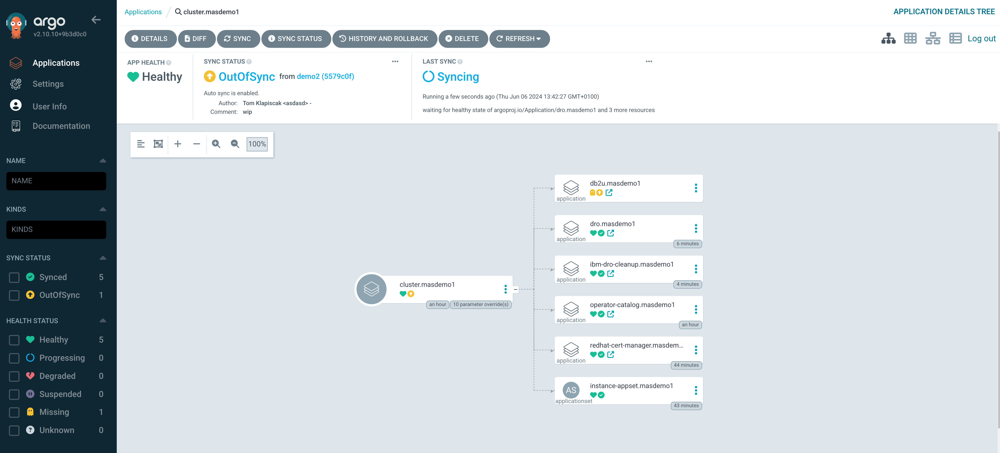

It should take less than 10 minutes for this application to reach Healthy/Synced status. You can safely proceed with the next steps of this demonstration before this happens.


### Setup Mongo


IBM Maximo Application Suite and the the IBM Suite License Service depend on MongoDB. In this demonstration, we will make use of AWS DocumentDB (DocDB). The following commands will provision a 3 node `db.t3.medium` DocDB instance in your AWS account. A new secret (`${ACCOUNT_ID}/${CLUSTER_ID}/mongo`) will be added to AWS Secrets Manager holding all the information necessary to connect, which will be used by the IBM Suite License Service and any instances of IBM Maximo Application Suite installed on this cluster.

> It is possible to use other MongoDB providers with MAS Gitops, but this is not covered in this demonstration.

```bash

# First, get the name of the VPC associated with your ROSA cluster
VPC_NAME="$(rosa describe cluster --cluster=${CLUSTER_ID} -oyaml | /usr/bin/yq .infra_id)-vpc"

# Use the VPC_NAME this to get its ID
export VPC_ID=$(aws ec2 describe-vpcs --filters '[{"Name": "tag:Name", "Values": ["'${VPC_NAME}'"]}]' --output yaml | yq -r '.Vpcs[].VpcId')

# Associate a new CIDR block with the VPC. We will use this to assign IP addresses to DocDB.
aws ec2 associate-vpc-cidr-block \
--vpc-id $VPC_ID \
--cidr-block 10.1.0.0/23

# Provision DocDB and register its details in the ${ACCOUNT_ID}/${CLUSTER_ID}/mongo secret
mas gitops-mongo \
  --mongo-provider "aws" \
  --aws-vpc-id "${VPC_ID}" \
  --aws-docdb-cluster-name "docdb-${CLUSTER_ID}" \
  --aws-docdb-ingress-cidr "10.0.0.0/16"  \
  --aws-docdb-egress-cidr "10.0.0.0/16" \
  --aws-docdb-cidr-az1 "10.1.0.0/27" \
  --aws-docdb-cidr-az2 "10.1.0.32/27" \
  --aws-docdb-cidr-az3 "10.1.0.64/27" \
  --aws-docdb-instance-identifier-prefix "docdb-${CLUSTER_ID}" \
  --aws-docdb-instance-number 3 \
  --aws-docdb-engine-version "5.0.0"
```

### Configure License File for Maximo Application Suite Core Platform

In a new terminal session, run the following command to copy your MAS License file into the MAS CLI container:

```bash
# The path to your MAS license file (.lic extension)
LICENSE_FILE_PATH="xxx"

# You can find this by running the command: docker ps
CLI_CONTAINER_ID="xxx"

docker cp "${LICENSE_FILE_PATH}" "${CLI_CONTAINER_ID}:/mascli/license.lic"
```

Now go back to your MAS CLI terminal session, and run the following:

```bash
mas gitops-license \
  --license-file "/mascli/license.lic"
```

This will create the following secret in AWS Secret Manager: `${ACCOUNT_ID}/${CLUSTER_ID}/${MAS_INSTANCE_ID}/license`.


### Install Maximo Application Suite Core Platform

```bash
# NOTE: this depends on the ROSA_CLUSTER_API_URL variable set earlier in this demonstration to work
OCP_DOMAIN="$(echo ${ROSA_CLUSTER_API_URL} | awk -F[/:] '{print $4}' | sed 's/^api\.//')"
MAS_DOMAIN="${MAS_INSTANCE_ID}.apps.${OCP_DOMAIN}"

mas gitops-suite \
  --github-push \
  --mongo-provider aws \
  --user-action "add" \
  --sls-channel 3.x \
  --mas-channel 8.11.x \
  --mas-domain "${MAS_DOMAIN}"
```

This will generate three new configuration files and push them to your **Git Config Repo**:
- `/${ACCOUNT_ID}/${CLUSTER_ID}/${MAS_INSTANCE_ID}/ibm-mas-instance-base.yaml`
- `/${ACCOUNT_ID}/${CLUSTER_ID}/${MAS_INSTANCE_ID}/ibm-mas-suite.yaml`
- `/${ACCOUNT_ID}/${CLUSTER_ID}/${MAS_INSTANCE_ID}/ibm-sls.yaml`

It will create one new secret `${ACCOUNT_ID}/${CLUSTER_ID}/${MAS_INSTANCE_ID}/mongo` that includes the connection details from the cluster-level `${ACCOUNT_ID}/${CLUSTER_ID}/mongo` that was created earlier.


After a few minutes you should see a new **Instance Root Application** appear as a child of the **Instance Root Application Set** under the **Cluster Root Application**:

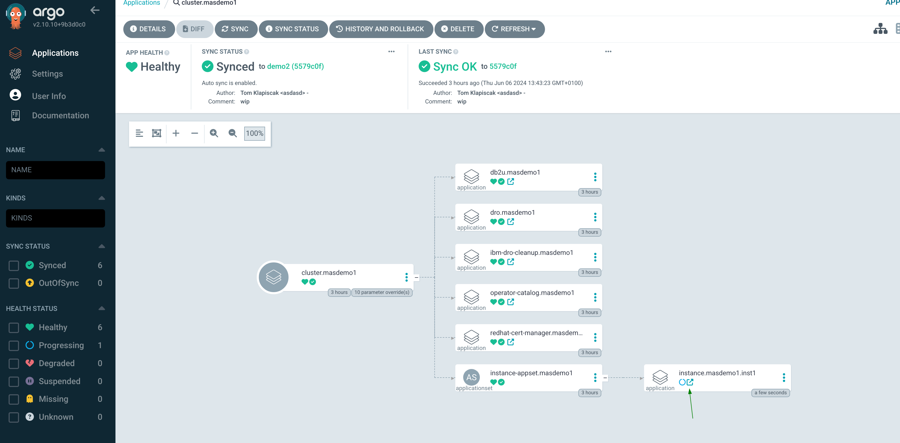

Navigate to the **Instance Root Application** by clicking the **Open Application** button indicated in the screenshot above.
You will see three child applications:
- `sls.demo.us-east-2.demo1.dev1`
- `suite.demo.us-east-2.demo1.dev1`

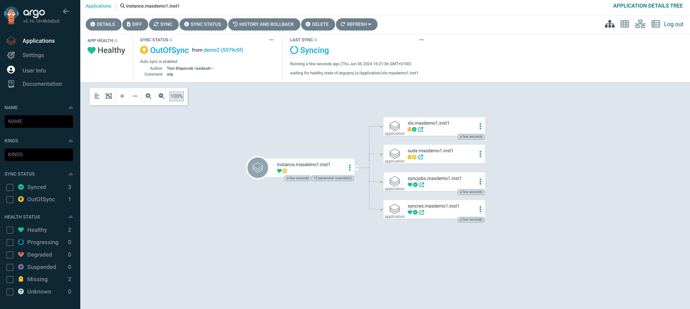

> TODO: syncjob creates user in docdb and adds creds to mongo instance secret. This will be used to access DocDB by both SLS and MAS.

> TODO: SLS syncs, then Suite syncs

After the Suite License Service application sync completes and it progresses to `Healthy` you will find one more entry has been created in Secret Manager: `${ACCOUNT_ID}/${CLUSTER_ID}/${MAS_INSTANCE_ID}/sls`. This was created by a Job in the SLS Helm Chart.

The Suite application will not change to Healthy status until we complete the next step to configure its connection to DRO, SLS, and MongoDb.

### Configure Maximo Application Suite Core Platform
```bash

mas gitops-mas-config \
  --github-push \
  --mas-config-type mongo \
  --config-action upsert \
  --mas-config-scope system \
  --mongo-provider aws


mas gitops-mas-config \
  --github-push \
  --mas-config-type sls \
  --config-action upsert \
  --mas-config-scope system


DRO_CA_CERTIFICATE_FILE="/tmp/dro_ca.crt"

# > TODO: document use of https://github.com/ibm-mas/ansible-devops/blob/master/ibm/mas_devops/common_tasks/get_ingress_cert.yml in case user doesn't know the name of this secret
oc get secret default-ingress-cert -n openshift-ingress -ojsonpath='{.data.tls\.crt}' | base64 -d > ${DRO_CA_CERTIFICATE_FILE}

# > TODO: where does this come from? It is optional in the script, but if not set, AVP refuses to render the app due to missing secret
MAS_SEGMENT_KEY="xxx"
mas gitops-mas-config \
  --github-push \
  --mas-config-type bas \
  --config-action upsert \
  --mas-config-scope system \
  --dro-contact-email email.com \
  --dro-contact-firstname joe \
  --dro-contact-lastname bloggs \
  --dro-ca-certificate-file $DRO_CA_CERTIFICATE_FILE \
  --mas-segment-key "${MAS_SEGMENT_KEY}"
```

This will generate the 3 configurations that need to be applied to the Core Platform:
- [/demo/us-east-2/demo1/dev1/configs/system.ibm-mas-bas-config.yaml](/demo/us-east-2/demo1/dev1/configs/system.ibm-mas-bas-config.yaml)
- [/demo/us-east-2/demo1/configs/system.ibm-mas-mongo-config.yaml](/demo/us-east-2/demo1/dev1/configs/system.ibm-mas-mongo-config.yaml)
- [/demo/us-east-2/demo1/configs/system.ibm-mas-sls-config.yaml](/demo/us-east-2/demo1/dev1/configs/system.ibm-mas-sls-config.yaml)

Once these three new applications are synced and healthy the Suite application will change to report healthy status as well and you have successfully installed and configured the Maximo Application Suite Core Platform

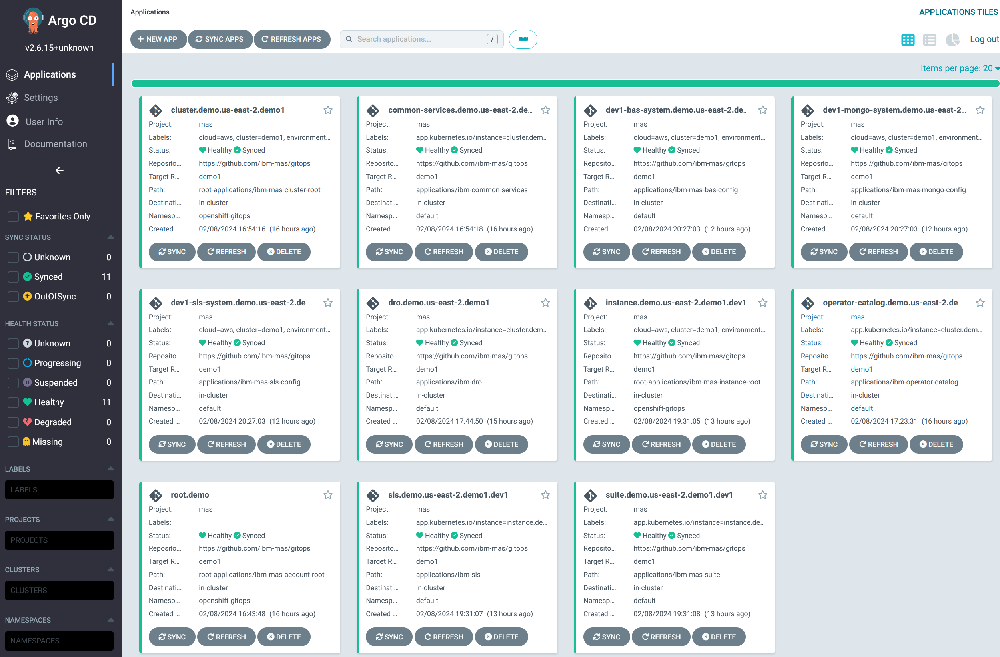

Next, we create the Workspace to complete the base configuration of the Maximo Application Suite Core Platform:

```bash
mas gitops-suite-workspace \
  --github-push \
  --mas-instance-id "${MAS_INSTANCE_ID}" \
  --mas-workspace-id "${MAS_WORKSPACE_ID}" \
  --mas-workspace-name "${MAS_WORKSPACE_NAME}"
```

After committing the generated configuration file, ArgoCD will install the 12th and final ArgoCD Application will appear:

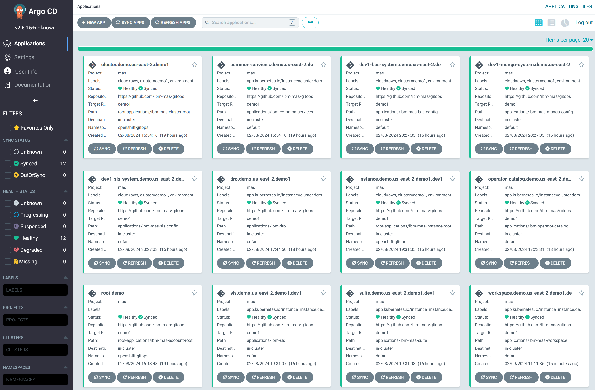

We can review all the secrets created during the install using the command below:
```bash
aws secretsmanager list-secrets --output yaml --no-cli-pager | yq -r '.SecretList[].Name' | grep "^demo/demo1" | sort
```
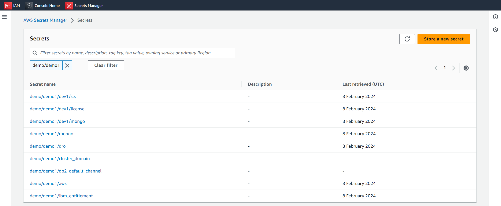


### Configure DB2 Database for MAS Manage Application
First, you'll need to create an EFS filesystem in the same region as your ROSA cluster, then create mount targets for the EFS filesystem in the same VPC and subnets as your ROSA cluster. Please refer to the [AWS documentation](https://docs.aws.amazon.com/efs/latest/ug/gs-step-two-create-efs-resources.html). Once created, determine the name of the associated StorageClass in the cluster (`oc get storageclasses`).


```bash

# The name of the EFS StorageClass in ROSA
export STORAGE_CLASS="efs-xxx"


mas gitops-db2u-database \
  --github-push \
  --db2-version "s11.5.9.0-cn1" \
  --db2-4k-device-support "" \
  --db2-workload "" \
  --db2-meta-storage-class "${STORAGE_CLASS}" \
  --db2-backup-storage-class "${STORAGE_CLASS}" \
  --db2-data-storage-class "${STORAGE_CLASS}" \
  --db2-temp-storage-class "${STORAGE_CLASS}" \
  --db2-logs-storage-class "${STORAGE_CLASS}" \
  --db2-database-db-config-yaml "/demo-files/db2/db2_database_db_config_manage.yaml" \
  --db2-instance-dbm-config-yaml "/demo-files/db2/db2_instance_dbm_config_manage.yaml" \
  --db2-instance-registry-yaml "/demo-files/db2/db2_instance_registry_manage.yaml" \
  --mas-app-id "manage"
```


### Configure MAS with Manage DB2 Database

```bash
mas gitops-mas-config \
  --github-push \
  --mas-config-type jdbc \
  --config-action upsert \
  --mas-config-scope wsapp \
  --mas-app-id "manage" \
  --mas-workspace-id "${MAS_WORKSPACE_ID}" \
  --db2-instance-name "db2wh-${MAS_INSTANCE_ID}-manage"
```


### 12. Install Manage

```bash
mas gitops-suite-app-install \
  --github-push  \
  --mas-app-id  "manage" \
  --mas-app-channel  "8.7.x" \
  --mas-app-catalog-source "ibm-operator-catalog" \
  --mas-app-api-version "apps.mas.ibm.com/v1" \
  --mas-app-kind "ManageApp" \
  --mas-edition "essentials-maintenance"
```


### 13. Configure Manage

```bash

# Run a script to generate YAML containing basic server bundles for Manage
# The exported values of the MAS_INSTANCE_ID and MAS_WORKSPACE_ID env vars will substituted in where appropriate
bash /demo-files/manage/generate-server-bundles.sh

# Run a script to generate YAML containing the spec for the Manage Workspace we are about to create
# The exported values of the STORAGE_CLASS and MAS_WORKSPACE_ID env vars will substituted in where appropriate
bash /demo-files/manage/generate-server-bundles.sh

export DEFAULT_FILE_STORAGE_CLASS="${STORAGE_CLASS}"

mas gitops-suite-app-config \
  --github-push \
  --mas-app-id  "manage" \
  --mas-app-kind "ManageApp" \
  --mas-appws-api-version "apps.mas.ibm.com/v1" \
  --mas-appws-kind "ManageWorkspace" \
  --mas-appws-spec-yaml "/demo-files/manage/manage-appws-spec.yaml" \
  --mas-app-server-bundles-combined-add-server-config-yaml "/demo-files/manage/manage-server-bundles.yaml"
```


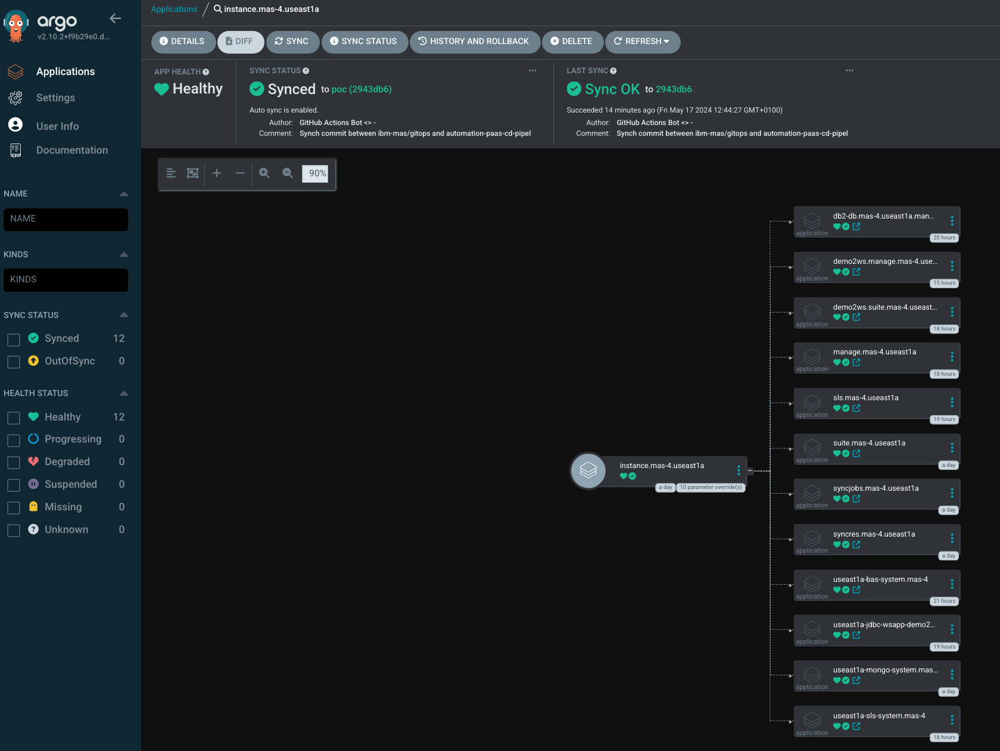


# Known Issues / Troubleshooting

If you change any values in secrets manager, you must hard-refresh the appropriate ArgoCD application in order for the updates to be picked up by ArgoCD
> TODO: screenshot


Cert deprovisioning steps will hang unless using ArgoCD 2.11.0 or later. If on ArgoCD <2.11, ensure the following steps are performed manually to avoid the problem:
> TODO