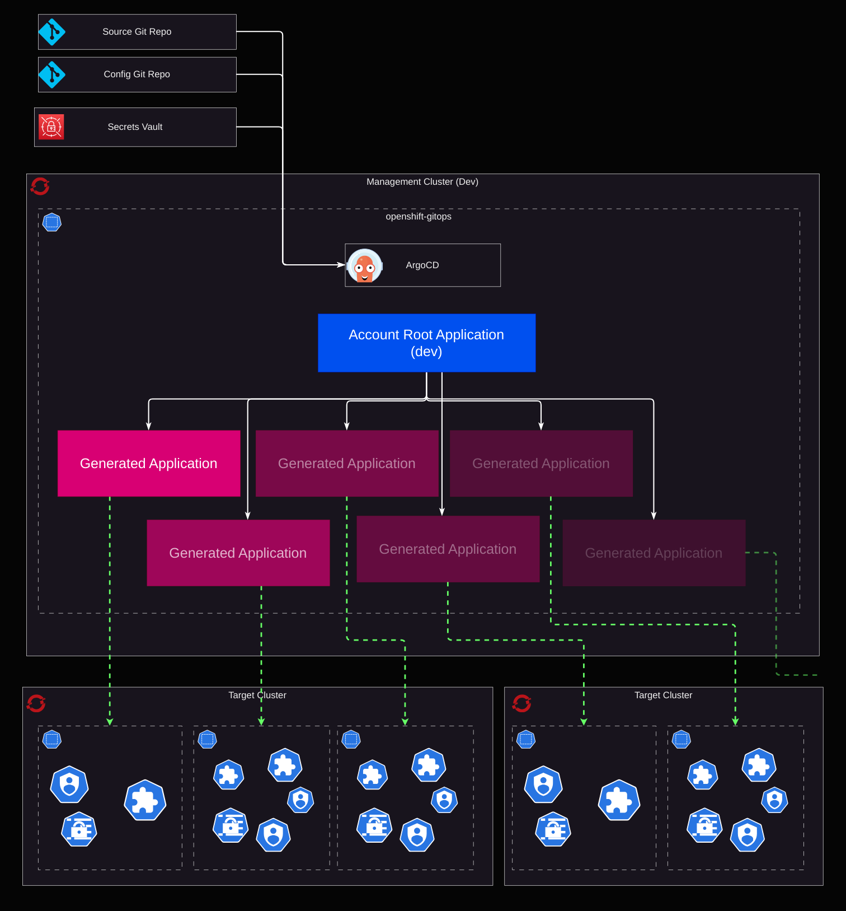
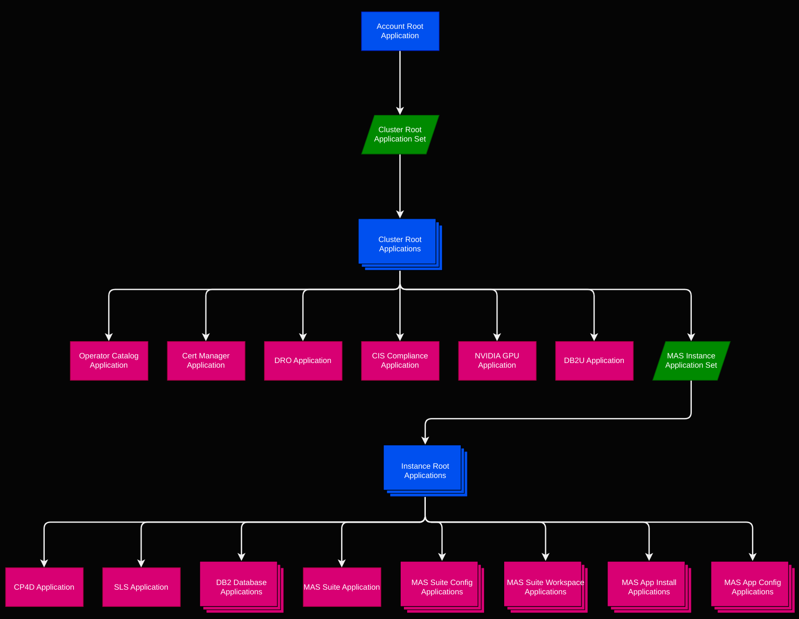
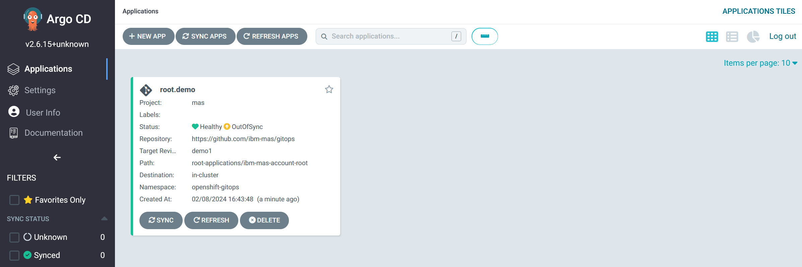
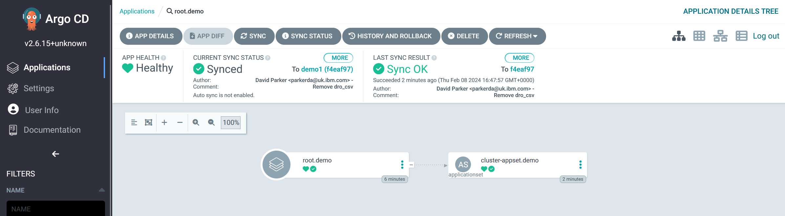
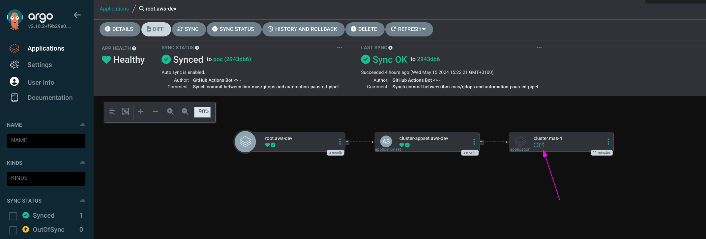
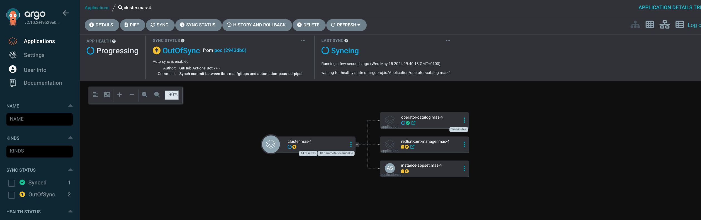
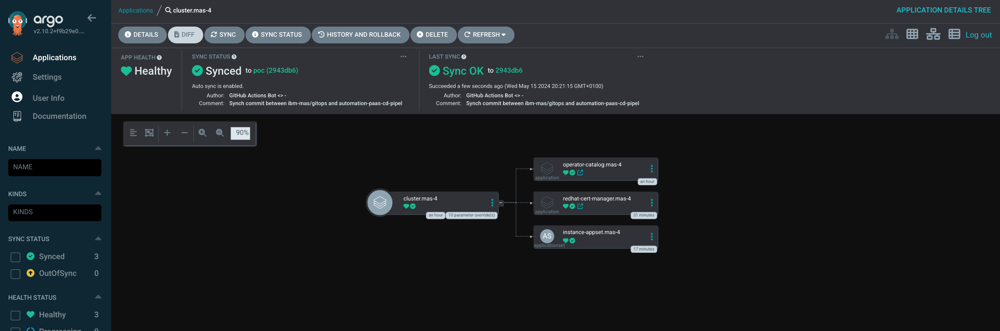
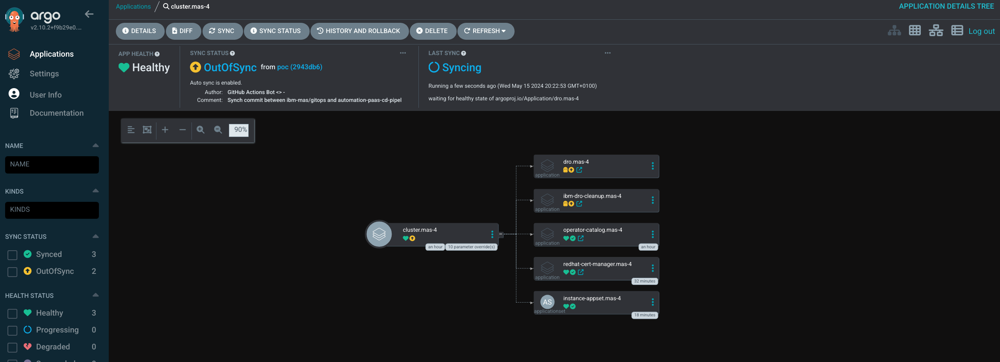
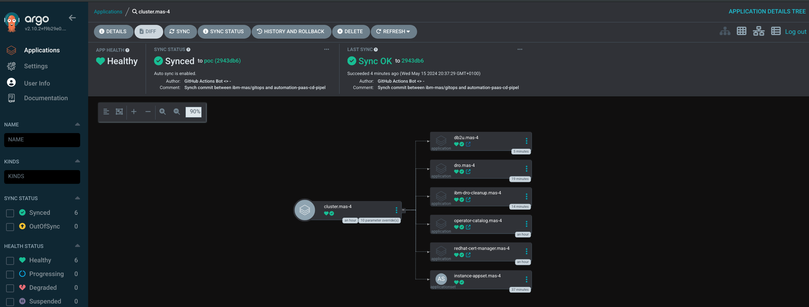
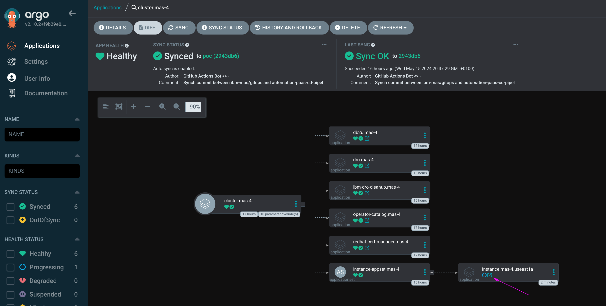

# Maximo Application Suite GitOps Demo

## Overview

IBM provides a collection of Helm charts intended for use with ArgoCD for employing the GitOps approach to manage many MAS instances spread across many OCP clusters. ArgoCD is installed on some OCP cluster. It obtains the MAS GitOps Helm charts from some _source_ Git repo (i.e. [ibm-mas/gitops](https://github.com/ibm-mas/gitops)). The _config_ Git repo holds configuration YAML files that define the desired structure and configuration of a collection of MAS instances. Secret values (which must be stored securely and not exposed in the _config_ Git repo) are fetched using the [ArgoCD Vault Plugin](https://argocd-vault-plugin.readthedocs.io/en/stable/) from some backend (e.g. AWS Secrets Manager).



The **Account Root Application** is created in ArgoCD to bootstrap the process. This is the only ArgoCD application that is directly created on the cluster, all other applications are generated by ArgoCD following the [App of Apps pattern](https://argo-cd.readthedocs.io/en/stable/operator-manual/cluster-bootstrapping/#app-of-apps-pattern). It serves as the "entry point" to provide various global configuration parameters and to kick off the process of generating ArgoCD Applications to deploy and manage MAS resources on a set of target OCP clusters for a particular "account" (e.g. "dev", "staging", "prod") via ArgoCD. The structure of the manifest for the Account Root Application, along with full list of parameters is given in the gitops [README](https://github.com/ibm-mas/gitops/blob/demo2/README.md).

> In the tutorial provided later in this README, for simplicitly, we will restrict the deployment to a single MAS Instance running in the same cluster as ArgoCD.

The following figure shows the generated tree of ArgoCD applications (and ApplicationSets), starting with the Account Root Application at the top:




The **Account Root Application** [Helm Chart]((https://github.com/ibm-mas/gitops/tree/demo2/root-applications/ibm-mas-account-root)) installs the **[Cluster Root Application Set](https://github.com/ibm-mas/gitops/tree/demo2/root-applications/ibm-mas-account-root/templates/000-cluster-appset.yaml)**. This generates a set of **MAS Cluster Root Applications** based on the configuration in the _config_ Git repo. The **MAS Cluster Root Application** [Helm Chart](https://github.com/ibm-mas/gitops/tree/demo2/root-applications/ibm-mas-cluster-root) installs ArgoCD Applications that configure various cluster-wide dependencies required by MAS instances on the target cluster, including:

- [Operator Catalog](https://github.com/ibm-mas/gitops/blob/demo2/root-applications/ibm-mas-cluster-root/templates/000-ibm-operator-catalog-app.yaml) ([Helm Chart](https://github.com/ibm-mas/gitops/blob/demo2/cluster-applications/))
- [Redhat Certificate Manager](https://github.com/ibm-mas/gitops/blob/demo2/root-applications/ibm-mas-cluster-root/templates/010-ibm-redhat-cert-manager-app.yaml) ([Helm Chart](https://github.com/ibm-mas/gitops/blob/demo2/cluster-applications/010-redhat-cert-manager))
- [DRO](https://github.com/ibm-mas/gitops/blob/demo2/root-applications/ibm-mas-cluster-root/templates/010-ibm-dro-app.yaml) ([Helm Chart](https://github.com/ibm-mas/gitops/blob/demo2/cluster-applications/020-ibm-dro))
- [Db2u Operator](https://github.com/ibm-mas/gitops/blob/demo2/root-applications/ibm-mas-cluster-root/templates/020-ibm-db2u-app.yaml) ([Helm Chart](https://github.com/ibm-mas/gitops/blob/demo2/cluster-applications/060-ibm-db2u))
- [CIS Compliance](https://github.com/ibm-mas/gitops/blob/demo2/root-applications/ibm-mas-cluster-root/templates/040-cis-compliance-app.yaml) ([Helm Chart](https://github.com/ibm-mas/gitops/blob/demo2/cluster-applications/040-cis-compliance))
- [Nvidia GPU Operator](https://github.com/ibm-mas/gitops/blob/demo2/root-applications/ibm-mas-cluster-root/templates/050-nvidia-gpu-operator-app) ([Helm Chart](https://github.com/ibm-mas/gitops/blob/demo2/cluster-applications/050-nvidia-gpu-operator))


The **Cluster Root Application Set** also installs the **[MAS Instance Application Set](https://github.com/ibm-mas/gitops/blob/demo2/root-applications/ibm-mas-cluster-root/templates/099-instance-appset.yaml)**. This generates a set of **MAS Instance Root Applications** based on the configuration in the _config_ Git repo.  The **MAS Instance Root Application** [Helm Chart](https://github.com/ibm-mas/gitops/tree/demo2/root-applications/ibm-mas-instance-root) generates ArgoCD Applications that install and configure some instance-level dependencies (e.g. SLS, DB2 Databases), MAS Core and various (MAS) applications (e.g. Manage, Monitor, etc).

Some of these templates generate a single ArgoCD Application that renders its own Helm chart:
 
- [CP4D](https://github.com/ibm-mas/gitops/blob/demo2/root-applications/ibm-mas-instance-root/templates/080-ibm-cp4d.yaml) ([Helm Chart](https://github.com/ibm-mas/gitops/blob/demo2/instance-applications/080-ibm-cp4d))
- [Suite License Service](https://github.com/ibm-mas/gitops/blob/demo2/root-applications/ibm-mas-instance-root/templates/100-ibm-sls-app.yaml) ([Helm Chart](https://github.com/ibm-mas/gitops/blob/demo2/instance-applications/100-ibm-sls))
- [MAS Suite](https://github.com/ibm-mas/gitops/blob/demo2/root-applications/ibm-mas-instance-root/templates/130-ibm-mas-suite-app.yaml) ([Helm Chart](https://github.com/ibm-mas/gitops/blob/demo2/instance-applications/130-ibm-mas-suite))

There is a unique template for installing each MAS Application, but all of these templates make use of a generic Suite App Install [Helm Chart](https://github.com/ibm-mas/gitops/blob/demo2/instance-applications/500-540-ibm-mas-suite-app-install):
- [MAS App Assist Install](https://github.com/ibm-mas/gitops/blob/demo2/root-applications/ibm-mas-instance-root/templates/500-ibm-mas-masapp-assist-install.yaml)
- [MAS App IoT Install](https://github.com/ibm-mas/gitops/blob/demo2/root-applications/ibm-mas-instance-root/templates/500-ibm-mas-masapp-iot-install.yaml)
- [MAS App Manage Install](https://github.com/ibm-mas/gitops/blob/demo2/root-applications/ibm-mas-instance-root/templates/500-ibm-mas-masapp-manage-install.yaml)
- [MAS App VisualInspection Install](https://github.com/ibm-mas/gitops/blob/demo2/root-applications/ibm-mas-instance-root/templates/500-ibm-mas-masapp-visualinspection-install.yaml)
- [MAS App Health Install](https://github.com/ibm-mas/gitops/blob/demo2/root-applications/ibm-mas-instance-root/templates/520-ibm-mas-masapp-health-install.yaml)
- [MAS App Monitor Install](https://github.com/ibm-mas/gitops/blob/demo2/root-applications/ibm-mas-instance-root/templates/520-ibm-mas-masapp-monitor-install.yaml)
- [MAS App Optimizer Install](https://github.com/ibm-mas/gitops/blob/demo2/root-applications/ibm-mas-instance-root/templates/520-ibm-mas-masapp-optimizer-install.yaml)
- [MAS App Predict Install](https://github.com/ibm-mas/gitops/blob/demo2/root-applications/ibm-mas-instance-root/templates/540-ibm-mas-masapp-predict-install.yaml)


Some of the templates in the chart are capable of generating multiple Applications that install a Helm chart on the target cluster. This is used when there may be one or more instances of the particular resources being configured and will vary between MAS instances - for instance DB2 databases, suite configs, and suite/application workspaces. 

>  This achieved through via the use of the Helm `range` control structure in the template. This approach was used in favour of ArgoCD [Application Sets](https://argo-cd.readthedocs.io/en/stable/operator-manual/applicationset/) in these cases due to some limitations we encountered when using Application Sets. For instance, Applications generated by Application Sets do not participate in the [ArgoCD syncwave](https://argo-cd.readthedocs.io/en/stable/user-guide/sync-waves/) of the parent Application, meaning that we would have no way of ensuring that resources would be configured in the correct order.

- [DB2 Databases](https://github.com/ibm-mas/gitops/blob/demo2/root-applications/ibm-mas-instance-root/templates/120-db2-databases-app.yaml) ([Helm Chart](https://github.com/ibm-mas/gitops/blob/demo2/instance-applications/120-ibm-db2u-database))
- [MAS Workspaces](https://github.com/ibm-mas/gitops/blob/demo2/root-applications/ibm-mas-instance-root/templates/200-ibm-mas-workspaces.yaml) ([Helm Chart](https://github.com/ibm-mas/gitops/blob/demo2/instance-applications/220-ibm-mas-workspace))
- [MAS App Configs](https://github.com/ibm-mas/gitops/blob/demo2/root-applications/ibm-mas-instance-root/templates/510-550-ibm-mas-masapp-configs) ([Helm Chart](https://github.com/ibm-mas/gitops/blob/demo2/instance-applications/510-550-ibm-mas-suite-app-config))

A special case is the [Suite Configs](https://github.com/ibm-mas/gitops/blob/demo2/root-applications/ibm-mas-instance-root/templates/130-ibm-mas-suite-configs-app.yaml) application. This is also capable of generating many ArgoCD Applications, but the specific Helm chart used is dynamic. It used to setup various suite configuration types (Mongo, BAS, SMTP, etc) at various scopes (system, app, ws, wsapp). Depending on the configuration type, it installs one of the following Helm Charts:
- [JDBC](https://github.com/ibm-mas/gitops/blob/demo2/root-applications/ibm-mas-instance-root/templates/130-ibm-db2u-jdbc-config)
- [Kafka](https://github.com/ibm-mas/gitops/blob/demo2/root-applications/ibm-mas-instance-root/templates/130-ibm-kafka-config)
- [BAS](https://github.com/ibm-mas/gitops/blob/demo2/root-applications/ibm-mas-instance-root/templates/130-ibm-mas-bas-config)
- [IDP](https://github.com/ibm-mas/gitops/blob/demo2/root-applications/ibm-mas-instance-root/templates/130-ibm-mas-idp-config)
- [Mongo](https://github.com/ibm-mas/gitops/blob/demo2/root-applications/ibm-mas-instance-root/templates/130-ibm-mas-mongo-config)
- [SLS](https://github.com/ibm-mas/gitops/blob/demo2/root-applications/ibm-mas-instance-root/templates/130-ibm-mas-sls-config)
- [SMTP](https://github.com/ibm-mas/gitops/blob/demo2/root-applications/ibm-mas-instance-root/templates/130-ibm-mas-smtp-config)
- [COS](https://github.com/ibm-mas/gitops/blob/demo2/root-applications/ibm-mas-instance-root/templates/130-ibm-objectstorage-config)

## GitOps with the MAS CLI
We have automated the steps to install MAS via GitOps, you will not need to use the MAS CLI to use our ArgoCD applications, but at this stage of development there is no documentation in place for this.

Note: To access the same version of the MAS CLI used when creating this demo run the following command:

```bash
docker run -ti --pull always quay.io/ibmmas/cli:8.1.0-pre.gitops
```

### Naming Restrictions

**Naming Length Restrictions** Because we stitch together the different IDs that form the hierarchy together we need to ensure that the total length is less than the 64 character limit of ArgoCD applications, to achieve this follow these restrictions when setting values for `--account-id`, -`region-id`, `--cluster-id`, and `--mas-instance-id`:

> TODO: these have changed - only cluster and mas instance ID are now significant.
> TODO: 1 account ID per ArgoCD project.
> TODO: cluster IDs must be unique across all regions in the same account.
- **Account ID**: 8 characters
- **Region ID**: 14 characters
- **Cluster ID**: 7 characters
- **MAS instance ID**: 5 characters

> TODO: we do support multi-project deployments now (root manifest param)
**Why such long application names?** This is primarily due to a limitation we have inherited to be compatible with internal IBM systems where we must have everything under a single ArgoCD project. We would like to support single/multi-project configurations in the long term, but it's not a priority at the moment.

The naming structure in use today is not final, and we do expect to relax these restrictions before the first release.

> TODO: highlight assumption that ArgoCD and MAS live in the same cluster in this demo (although we do support off cluster argocd)

### 1. Provision an OCP Cluster
> TODO: update this
```bash
export IBMCLOUD_APIKEY=xxx
mas provision-roks -r mas-development -c gitopsdemo -v 4.12_openshift --worker-count 3 --worker-flavor b3c.16x64.300gb --worker-zone lon02 --no-confirm
```

When this completed you will be logged into the OCP cluster ready to continue.

### 2. Setup Secrets Manager
Set up [AWS Secrets Manager](https://us-east-2.console.aws.amazon.com/secretsmanager/listsecrets?region=us-east-2), and [create an access key](https://us-east-1.console.aws.amazon.com/iam/home#/security_credentials?section=IAM_credentials)


### 3. Setup common environment variables
> TODO: document the meaning of each section of env vars

The CLI allows arguments to be passed in both via command-line arguments and environment variables. For repeated parameters that are used by many of the functions that we are going to call, we are going to export them as environment variables so we don't have to specify them every time. Please customize the variables below and run the following in your mas-cli terminal session:

```bash
export ACCOUNT_ID="demo"
export CLUSTER_ID="useast1a"
export CLUSTER_URL="https://kubernetes.default.svc"
export MAS_INSTANCE_ID="inst1"
export MAS_WORKSPACE_ID="demo2ws"
export MAS_WORKSPACE_NAME="demo2 workspace"


export SM_AWS_REGION="us-east-1"
export SM_AWS_SECRET_ACCESS_KEY="xxx"
export SM_AWS_ACCESS_KEY_ID="xxx"
export SECRETS_PATH="arn:aws:secretsmanager:us-east-1:xxxxxxxxxxxx:secret"
```


### 3. Setup your gitops repository
Git repositories are used to supply ArgoCD with both the **Helm Charts** for the MAS installation (the _source_ Git repo), as well as a collection of per-cluster/instance **configuration** files used to render those templates into Kubernetes (the _config_ Git repo).

The **Helm Charts** are provided by IBM in the public [ibm-mas/gitops](https://github.com/ibm-mas/gitops) repository on github.com. It is recommended that you use this repo (and we will do so in this demonstration), but you are free to fork them into your own git repository if necessary.

For the **configuration** files you will need to setup a new git repository in your preferred provider and supply its details to the CLI via some environment variables. In your mas cli terminal session, run the following, subtituting in the values for your git repository:

```bash
export GITOPS_VERSION="master"
export GITHUB_HOST="github.com"
export GITHUB_ORG="ibm-mas"
export GITHUB_REPO="gitops-demo"
export GIT_BRANCH="002"
export GIT_SSH="false"
```

Create a personal access token in your git provider, ensuring that it has sufficient permissions to read and write from your git repository. Set it in your environment as follows:
```bash
export GITHUB_PAT="xxx"
```

And configure git:
```bash
git config --global user.email "you@example.com"
```


### 3. Bootstrap ArgoCD and create the Account Root Application
> TODO: allow use of an existing ArgoCD? I.e. bootstrap *just* creates the account root appliction?
> TODO: update gitops-bootstrap to allow setting of all new root application parameters
> TODO: test gitops-bootstrap in a blank cluster (can't do this in mas-4)

The `mas gitops-bootstrap` function will perform the following actions:
- Install ArgoCD operator
- Create ArgoCD instance
- Configure Secret Manager backend for ArgoCD
- Configure ArgoCD ServiceAccount and RBAC
- Enable the ArgoCD Vault plugin
- Configure ArgoCD authentication to your application repository using personal access token
- Patch `openshift-marketplace` and `kube-system` namespaces to allow ArgoCD to manage them
- Add `cluster-admin` access to openshift-gitops ServiceAccount (required for managing CecurityContextContraints)
- Create an ArgoCD project for Maximo Application Suite
- Create the Maximo Application Suite **Account Root Application**

```bash

PAT=xxx

mas gitops-bootstrap \
  --account-id "${ACCOUNT_ID}" \
  --app-revision demo1 \
  --sm-aws-secret-region "$REGION_ID" \
  --sm-aws-secret-key $SECRET_KEY \
  --sm-aws-access-key $ACCESS_KEY \
  --github-url https://github.com/ibm-mas/gitops-demo \
  --github-revision 001 \
  --github-pat $PAT
```

You will end up with the root application and a single ApplicationSet deployed in ArgoCD as below:
> TODO: update


Click "Sync" and after a short delay the application will change to "Synced" status:
> TODO: update


This is the only time we will directly make changes on the cluster, with the installation of the **Account Root Application** ArgoCD is ready to automatically deploy all necessary ArgoCD applications as you commit new configuration files to the GitHub configuration repository.

### 4. Generate configuration for the Cluster Root Application
The `mas gitops-cluster` function will perform the following actions:
- Create a new secret in AWS Secrets Manager `${ACCOUNT_ID}/${CLUSTER_ID}/ibm_entitlement` holding the image pull secret for the IBM Container Registry (which contains your IBM entitlement key)
- Create a new secret in AWS Secrets Manager `${ACCOUNT_ID}/${CLUSTER_ID}/aws` holding the access token and secret token for AWS Secrets Manager, which is used by various ArgoCD sync hooks to make updates to secrets
- Generate four new configuration files and push them to your gitops repository
    - `/${ACCOUNT_ID}/${CLUSTER_ID}/ibm-mas-cluster-base.yaml`
    - `/${ACCOUNT_ID}/${CLUSTER_ID}/ibm-common-services.yaml`
    - `/${ACCOUNT_ID}/${CLUSTER_ID}/ibm-mas-cluster-base.yaml`
    - `/${ACCOUNT_ID}/${CLUSTER_ID}/ibm-operator-catalog.yaml`
- The post sync hook in the cert manager application will register two new secrets in AWS Secrets Manager:
    - `${ACCOUNT_ID}/${CLUSTER_ID/db2_default_channel`
    - `${ACCOUNT_ID}/${CLUSTER_ID/cluster_domain`


```bash
ICR_USERNAME="xxx"
ICR_PASSWORD="xxx"

mas gitops-cluster \
  --github-push \
  --icr-username "${ICR_USERNAME}" \
  --icr-password "${ICR_PASSWORD}" \
  --catalog-version v8-240430-amd64 \
  --catalog-image icr.io/cpopen/ibm-maximo-operator-catalog \
  --catalog-action install \
  --common-services-channel v3.23 \
  --common-services-action install
```


Click on the account root application. It will take a few minutes for the cluster root application set to see the new configuration files in your gitops repository. Once this happens, you will see a new cluster root application appear as a child of the cluster application set:


Open the cluster root application by clicking on the button indicated in the screenshot above, the Operator Catalog and cert manager applications will be visible as children of the cluster root application:




The cert manager application will take a little longer to syncronize because it first waits for the Operator Catalog to be ready before installing the cert manager from that catalog. Within 10 minutes all applications should be reporting Healthy and Synced status. 




You can safely proceed with the next steps of this demonstration before this happens if you wish since ArgoCD will take care of orchestrating the deployment, ensuring that applications are only synced once its prerequisites are healthy.


### 5. Generate configuration for DRO
The `mas gitops-dro` function will generate one new configuration file in the GitHub working directory:
- `/${ACCOUNT_ID}/${CLUSTER_ID}/ibm-dro.yaml`

The post sync hook in ibm-dro will register a new secret in AWS Secrets Manager: `${ACCOUNT_ID}/${CLUSTER_ID/dro`

```bash
mas gitops-dro \
  --github-push
```

After a few minutes you should see two new applications appear as children of the cluster root application. The DRO application itself, along with a small "cleanup" application. The cleanup application contains an ArgoCD [PostDelete hook](https://argo-cd.readthedocs.io/en/stable/user-guide/resource_hooks/) necessary to ensure the DRO application is cleaned up properly when its config is deleted from the git repository. 



It should take less than 10 minutes for both of these application to reach Healthy/Synced status. Again, you can safely proceed with the next steps of this demonstration before this happens.


### 5. Generate configuration for the DB2U operator application
Later in this demonsration, we plan to install the Manage application in our MAS instance. Manage depends on a DB2 database, and we are going to deploy this database to our cluster. Before we do this, we must install the DB2U operator:

The `mas gitops-db2u` function will generate one new configuration file in the GitHub working directory:
- `/${ACCOUNT_ID}/${CLUSTER_ID}/ibm-db2u.yaml`


```bash
mas gitops-db2u \
  --github-push
```

After a few minutes you should see a new db2u application appear as a child of the cluster root application.



It should take less than 10 minutes for this application to reach Healthy/Synced status. Again, you can safely proceed with the next steps of this demonstration before this happens.


### 6. Generate configuration for MongoDb
> TODO: Could branch these instructions for users wishing to make use of docdb 
> (i.e. `--mongo-provider aws`).

> TODO: what is the cluster-level mongo secret actually used for when mongo-provider=yaml?
> it might be that we only need the user to provide instance-level mongo secret in this demo
>   used by gitops-suite (fetches secret and uses it to update the instance-level secret)
>     we could change this to just pass in mongo yaml and username/password to the suite

> TODO: make it clear that cluster admin mongo creds should be provided here

In this example we are going to be using an off-cluster MongoDB instance.  First, create a configuration file in the following format containing the details required to connect to your MongoDb instance:
```yaml
config:
  configDb: admin
  authMechanism: DEFAULT
  retryWrites: true
  hosts:
    - host: host1
      port: 32500
    - host: host2
      port: 32500
    - host: host3
      port: 32500
certificates:
  - alias: ca
    crt: |
      -----BEGIN CERTIFICATE-----
      <certificate body>
      -----END CERTIFICATE-----
```

Running `mas gitops-mongo` will now generate a new secret (`${ACCOUNT_ID}/${CLUSTER_ID}/mongo`) in AWS Secrets Manager holding all the information necessary to connect, which will be used by the IBM Suite License Service and any instances of IBM Maximo Application Suite installed on this cluster.

```bash
MONGO_INFO_YAML_PATH="xxx"

MONGO_USERNAME="xxx"
MONGO_PASSWORD="xxx"

mas gitops-mongo \
  --mongo-provider yaml \
  --yaml-file $MONGO_INFO_YAML_PATH \
  --mongo-username "${MONGO_USERNAME}" \
  --mongo-password "${MONGO_PASSWORD}"
```

### 7. Configure MongoDb Account for Maximo Application Suite Core Platform
> TODO: could look at automating this step by adding support for "normal" Mongo to
> instance-applications/010-ibm-sync-jobs/templates/00-aws-docdb-add-user_Job.yaml hook
```bash

> TODO: make it clear that a separate user should be setup in Mongo for the MAS instance
> Or, just advise to use the cluster admin creds configured above?

MONGO_INSTANCE_USERNAME="xxx"
MONGO_INSTANCE_PASSWORD="xxx"

aws configure set default.region ${SM_AWS_REGION}
aws configure set aws_access_key_id ${SM_AWS_ACCESS_KEY_ID}
aws configure set aws_secret_access_key ${SM_AWS_SECRET_ACCESS_KEY}
aws secretsmanager create-secret --name "${ACCOUNT_ID}/${CLUSTER_ID}/${MAS_INSTANCE_ID}/mongo" \
  --secret-string '{"username": "'${MONGO_INSTANCE_USERNAME}'", "password": "'${MONGO_INSTANCE_PASSWORD}'"}'
```

### 8. Configure License File for Maximo Application Suite Core Platform
```bash
LICENSE_FILE_PATH="xxx"

mas gitops-license \
  --license-file "${LICENSE_FILE_PATH}"
```

This will create another new entry to Secret Manager: `${ACCOUNT_ID}/${CLUSTER_ID}/${MAS_INSTANCE_ID}/license`.  We should now have 8 (TODO: 7?) secrets in total, as below:

```bash
aws configure set default.region ${SM_AWS_REGION}
aws configure set aws_access_key_id ${SM_AWS_ACCESS_KEY_ID}
aws configure set aws_secret_access_key ${SM_AWS_SECRET_ACCESS_KEY}
aws secretsmanager list-secrets --output yaml --no-cli-pager | yq -r '.SecretList[].Name' | grep "^${ACCOUNT_ID}/${CLUSTER_ID}" | sort
aws-dev/mas-4/aws
aws-dev/mas-4/cluster_domain
aws-dev/mas-4/db2_default_channel
aws-dev/mas-4/dro
aws-dev/mas-4/ibm_entitlement
aws-dev/mas-4/mongo   # TODO: remove this if we don't use cluster-level mongo secret in this demo
aws-dev/mas-4/useast1a/license
aws-dev/mas-4/useast1a/mongo
```

### 8. Install Maximo Application Suite Core Platform

```bash
OCP_DOMAIN="---.com"
MAS_DOMAIN="${MAS_INSTANCE_ID}.apps.rosa.${OCP_DOMAIN}"

mas gitops-suite \
  --github-push \
  --mongo-provider aws \
  --user-action "add" \
  --sls-channel 3.x \
  --mas-channel 8.11.x \
  --mas-domain "${MAS_DOMAIN}"
```

This will generate three new configuration files:
- `/${ACCOUNT_ID}/${CLUSTER_ID}/${MAS_INSTANCE_ID}/ibm-mas-instance-base.yaml`
- `/${ACCOUNT_ID}/${CLUSTER_ID}/${MAS_INSTANCE_ID}/ibm-mas-suite.yaml`
- `/${ACCOUNT_ID}/${CLUSTER_ID}/${MAS_INSTANCE_ID}/ibm-sls.yaml`


After a few minutes you should see a new instance root application `TODO` appear as a child of the instance application set under the cluster root application:



Navigate to the instance root application by clicking the button indicated in the screenshot above.
You will see three child applications:
- `sls.demo.us-east-2.demo1.dev1`
- `suite.demo.us-east-2.demo1.dev1`


After the Suite License Service application is synched you will find one more entry has been created in Secret Manager, created automatically by its post sync hook: `${ACCOUNT_ID}/${CLUSTER_ID}/${MAS_INSTANCE_ID}/sls`.

The Suite application will not change to Healthy status until we complete the next step to configure its connection to DRO, SLS, and MongoDb.

### 9. Configure Maximo Application Suite Core Platform
```bash

mas gitops-mas-config \
  --github-push \
  --mas-config-type mongo \
  --config-action upsert \
  --mas-config-scope system \
  --mongo-provider aws


mas gitops-mas-config \
  --github-push \
  --mas-config-type sls \
  --config-action upsert \
  --mas-config-scope system


DRO_CA_CERTIFICATE_FILE="/tmp/dro_ca.crt"

# > TODO: document use of https://github.com/ibm-mas/ansible-devops/blob/master/ibm/mas_devops/common_tasks/get_ingress_cert.yml in case user doesn't know the name of this secret
oc get secret default-ingress-cert -n openshift-ingress -ojsonpath='{.data.tls\.crt}' | base64 -d > ${DRO_CA_CERTIFICATE_FILE}

# > TODO: where does this come from? It is optional in the script, but if not set, AVP refuses to render the app due to missing secret
MAS_SEGMENT_KEY="xxx"
mas gitops-mas-config \
  --github-push \
  --mas-config-type bas \
  --config-action upsert \
  --mas-config-scope system \
  --dro-contact-email email.com \
  --dro-contact-firstname joe \
  --dro-contact-lastname bloggs \
  --dro-ca-certificate-file $DRO_CA_CERTIFICATE_FILE \
  --mas-segment-key "${MAS_SEGMENT_KEY}"
```

This will generate the 3 configurations that need to be applied to the Core Platform:
- [/demo/us-east-2/demo1/dev1/configs/system.ibm-mas-bas-config.yaml](/demo/us-east-2/demo1/dev1/configs/system.ibm-mas-bas-config.yaml)
- [/demo/us-east-2/demo1/configs/system.ibm-mas-mongo-config.yaml](/demo/us-east-2/demo1/dev1/configs/system.ibm-mas-mongo-config.yaml)
- [/demo/us-east-2/demo1/configs/system.ibm-mas-sls-config.yaml](/demo/us-east-2/demo1/dev1/configs/system.ibm-mas-sls-config.yaml)

Once these three new applications are synced and healthy the Suite application will change to report healthy status as well and you have successfully installed and configured the Maximo Application Suite Core Platform


Next, we create the Workspace to complete the base configuration of the Maximo Application Suite Core Platform:

```bash
mas gitops-suite-workspace \
  --github-push \
  --mas-instance-id "${MAS_INSTANCE_ID}" \
  --mas-workspace-id "${MAS_WORKSPACE_ID}" \
  --mas-workspace-name "${MAS_WORKSPACE_NAME}"
```

After committing the generated configuration file, ArgoCD will install the 12th and final ArgoCD Application will appear:


We can review all the secrets created during the install using the command below:
```bash
aws secretsmanager list-secrets --output yaml --no-cli-pager | yq -r '.SecretList[].Name' | grep "^demo/demo1" | sort
```


### 10. Configure DB2 Database for MAS Manage Application
First, you'll need to create an EFS filesystem in the same region as your ROSA cluster, then create mount targets for the EFS filesystem in the same VPC and subnets as your ROSA cluster. Please refer to the [AWS documentation](https://docs.aws.amazon.com/efs/latest/ug/gs-step-two-create-efs-resources.html). Once created, determine the name of the associated StorageClass in the cluster (`oc get storageclasses`).


```bash

# The name of the EFS StorageClass in ROSA
STORAGE_CLASS="efs-xxx"


DB2_DATABASE_DB_CONFIG_YAML="/tmp/db2_database_db_config_manage.yaml"
echo "
CHNGPGS_THRESH: '40'
DFT_QUERYOPT: '5'
LOGBUFSZ: '1024'
LOCKLIST: 'AUTOMATIC'
MAXFILOP: '61440'
NUM_IOCLEANERS: 'AUTOMATIC'
NUM_IOSERVERS: 'AUTOMATIC'
STMTHEAP: '20000'
CUR_COMMIT: 'ON'
AUTO_REVAL: 'DEFERRED'
DEC_TO_CHAR_FMT: 'NEW'
DATABASE_MEMORY: 'AUTOMATIC'
PCKCACHESZ: 'AUTOMATIC'
DBHEAP: 'AUTOMATIC'
STAT_HEAP_SZ: 'AUTOMATIC'
SOFTMAX: '0'
CATALOGCACHE_SZ: '800'
LOCKTIMEOUT: '300'
LOGPRIMARY: '100'
LOGSECOND: '156'
LOGFILSIZ: '32768'
LOGARCHMETH1: 'DISK:/mnt/bludata0/db2/archive_log/'
MIRRORLOGPATH: '/mnt/backup/MIRRORLOGPATH'
STMT_CONC: 'LITERALS'
DDL_CONSTRAINT_DEF: 'YES'
TRACKMOD: 'YES'
AUTO_DEL_REC_OBJ: 'ON'
REC_HIS_RETENTN: '60'
NUM_DB_BACKUPS: '60'
DFT_TABLE_ORG: 'ROW'
AUTO_MAINT: 'ON'
AUTO_TBL_MAINT: 'ON'
AUTO_RUNSTATS: 'ON'
AUTO_REORG: 'OFF'
AUTO_DB_BACKUP: 'OFF'
WLM_ADMISSION_CTRL: 'NO'
SHEAPTHRES_SHR: 'automatic'
SORTHEAP: 'automatic'
AUTHN_CACHE_USERS: '100'
AUTHN_CACHE_DURATION: '10'
APPLHEAPSZ: '8192 AUTOMATIC'
" > ${DB2_DATABASE_DB_CONFIG_YAML}


DB2_INSTANCE_DBM_CONFIG_YAML_FILE="/tmp/db2_instance_dbm_config_manage.yaml"
echo "
AGENT_STACK_SZ: '1024'
RQRIOBLK: '65535'
HEALTH_MON: 'OFF'
MON_HEAP_SZ: 'AUTOMATIC'
KEEPFENCED: 'NO'
FENCED_POOL: '50'
" > ${DB2_INSTANCE_DBM_CONFIG_YAML_FILE}

DB2_INSTANCE_REGISTRY_YAML_FILE="/tmp/db2_instance_registry_manage.yaml"
echo "
DB2_CDE_REDUCED_LOGGING: 'REDUCED_REDO:NO'
DB2_OBJECT_STORAGE_LOCAL_STAGING_PATH: '/mnt/backup/staging'
DB2_BCKP_PAGE_VERIFICATION: 'TRUE'
DB2_WORKLOAD: 'MAXIMO'
DB2_SKIPINSERTED: 'ON'
DB2_INLIST_TO_NLJN: 'YES'
DB2_MINIMIZE_LISTPREFETCH: 'Y'
DB2_EVALUNCOMMITTED: 'YES'
DB2_SKIPDELETED: 'ON'
DB2_FMP_COMM_HEAPSZ: '65536'
DB2_USE_ALTERNATE_PAGE_CLEANING: 'ON'
DB2AUTH: 'OSAUTHDB,ALLOW_LOCAL_FALLBACK,PLUGIN_AUTO_RELOAD'
DB2_4K_DEVICE_SUPPORT: 'ON'
DB2_FMP_RUN_AS_CONNECTED_USER: 'NO'
" > ${DB2_INSTANCE_REGISTRY_YAML_FILE}


mas gitops-db2u-database \
  --github-push \
  --db2-version "s11.5.9.0-cn1" \
  --db2-4k-device-support "" \
  --db2-workload "" \
  --db2-meta-storage-class "${STORAGE_CLASS}" \
  --db2-backup-storage-class "${STORAGE_CLASS}" \
  --db2-data-storage-class "${STORAGE_CLASS}" \
  --db2-temp-storage-class "${STORAGE_CLASS}" \
  --db2-logs-storage-class "${STORAGE_CLASS}" \
  --db2-database-db-config-yaml "${DB2_DATABASE_DB_CONFIG_YAML}" \
  --db2-instance-dbm-config-yaml "${DB2_INSTANCE_DBM_CONFIG_YAML_FILE}" \
  --db2-instance-registry-yaml "${DB2_INSTANCE_REGISTRY_YAML_FILE}" \
  --mas-app-id "manage"
```


### 11. Configure MAS with Manage DB2 Database

```bash
mas gitops-mas-config \
  --github-push \
  --mas-config-type jdbc \
  --config-action upsert \
  --mas-config-scope wsapp \
  --mas-app-id "manage" \
  --mas-workspace-id "${MAS_WORKSPACE_ID}" \
  --db2-instance-name "db2wh-${MAS_INSTANCE_ID}-manage"
```


### 12. Install Manage

```bash
mas gitops-suite-app-install \
  --github-push  \
  --mas-app-id  "manage" \
  --mas-app-channel  "8.7.x" \
  --mas-app-catalog-source "ibm-operator-catalog" \
  --mas-app-api-version "apps.mas.ibm.com/v1" \
  --mas-app-kind "ManageApp" \
  --mas-edition "essentials-maintenance"
```


### 13. Configure Manage

```bash

export DEFAULT_FILE_STORAGE_CLASS="${STORAGE_CLASS}"


# > TODO: figure out a better way of generating the server bundles - maybe a seperate script for the user to run

SB0_B64=$(echo -n '<?xml version="1.0" encoding="UTF-8"?>
<server description="new server '${MAS_WORKSPACE_ID}'-manage-d--sb0--asc--sn">
<featureManager>
<feature>jndi-1.0</feature>
<feature>wasJmsClient-2.0</feature>
<feature>jmsMdb-3.2</feature>
<feature>mdb-3.2</feature>
</featureManager>
    <jmsQueueConnectionFactory jndiName="jms/maximo/int/cf/intcf" connectionManagerRef="mifjmsconfact"><properties.wasJms remoteServerAddress="'${MAS_INSTANCE_ID}'-'${MAS_WORKSPACE_ID}'-jms.mas-'${MAS_INSTANCE_ID}'-manage.svc:7276:BootstrapBasicMessaging"/></jmsQueueConnectionFactory>
    <connectionManager id="mifjmsconfact" maxPoolSize="20"/>
    <jmsQueue jndiName="jms/maximo/int/queues/sqout"><properties.wasJms queueName="sqoutbd"/></jmsQueue>
    <jmsQueue jndiName="jms/maximo/int/queues/sqin"><properties.wasJms queueName="sqinbd"/></jmsQueue>
    <jmsQueue jndiName="jms/maximo/int/queues/cqin"><properties.wasJms queueName="cqinbd"/></jmsQueue>
    <jmsQueue jndiName="jms/maximo/int/queues/cqinerr"><properties.wasJms queueName="cqinerrbd"/></jmsQueue>
    <jmsQueue jndiName="jms/maximo/int/queues/cqout"><properties.wasJms queueName="cqoutbd"/></jmsQueue>
    <jmsQueue jndiName="jms/maximo/int/queues/cqouterr"><properties.wasJms queueName="cqouterrbd"/></jmsQueue>
    <jmsQueue jndiName="jms/maximo/int/queues/notf"><properties.wasJms queueName="notfbd"/></jmsQueue>
    <jmsQueue jndiName="jms/maximo/int/queues/notferr"><properties.wasJms queueName="notferrbd"/></jmsQueue>
</server>
' | base64 -w0)


SB1_B64=$(echo -n '<?xml version="1.0" encoding="UTF-8"?>
<server description="new server '${MAS_WORKSPACE_ID}'-manage-d--sb1--asc--sn">
<featureManager>
<feature>jndi-1.0</feature>
<feature>wasJmsClient-2.0</feature>
<feature>jmsMdb-3.2</feature>
<feature>mdb-3.2</feature>
</featureManager>
    <jmsQueueConnectionFactory jndiName="jms/maximo/int/cf/intcf" connectionManagerRef="mifjmsconfact"><properties.wasJms remoteServerAddress="'${MAS_INSTANCE_ID}'-'${MAS_WORKSPACE_ID}'-jms.mas-'${MAS_INSTANCE_ID}'-manage.svc:7276:BootstrapBasicMessaging"/></jmsQueueConnectionFactory>
    <connectionManager id="mifjmsconfact" maxPoolSize="20"/>
    <jmsQueue jndiName="jms/maximo/int/queues/sqout"><properties.wasJms queueName="sqoutbd"/></jmsQueue>
    <jmsQueue jndiName="jms/maximo/int/queues/sqin"><properties.wasJms queueName="sqinbd"/></jmsQueue>
    <jmsQueue jndiName="jms/maximo/int/queues/cqin"><properties.wasJms queueName="cqinbd"/></jmsQueue>
    <jmsQueue jndiName="jms/maximo/int/queues/cqinerr"><properties.wasJms queueName="cqinerrbd"/></jmsQueue>
    <jmsQueue jndiName="jms/maximo/int/queues/cqout"><properties.wasJms queueName="cqoutbd"/></jmsQueue>
    <jmsQueue jndiName="jms/maximo/int/queues/cqouterr"><properties.wasJms queueName="cqouterrbd"/></jmsQueue>
    <jmsQueue jndiName="jms/maximo/int/queues/notf"><properties.wasJms queueName="notfbd"/></jmsQueue>
    <jmsQueue jndiName="jms/maximo/int/queues/notferr"><properties.wasJms queueName="notferrbd"/></jmsQueue>
    <jmsActivationSpec id="maximomea/mboejb/JMSContQueueProcessor-1" maxEndpoints="5"><properties.wasJms destinationLookup="jms/maximo/int/queues/cqin" maxConcurrency="5" maxBatchSize="20" connectionFactoryLookup="jms/maximo/int/cf/intcf"/></jmsActivationSpec>
    <jmsActivationSpec id="maximomea/mboejb/JMSContQueueProcessor-2" maxEndpoints="1"><properties.wasJms destinationLookup="jms/maximo/int/queues/cqinerr" maxConcurrency="1" maxBatchSize="20" connectionFactoryLookup="jms/maximo/int/cf/intcf"/></jmsActivationSpec>
    <jmsActivationSpec id="maximomea/mboejb/JMSContOutQueueProcessor-1" maxEndpoints="5"><properties.wasJms destinationLookup="jms/maximo/int/queues/cqout" maxConcurrency="5" maxBatchSize="20" connectionFactoryLookup="jms/maximo/int/cf/intcf"/></jmsActivationSpec>
    <jmsActivationSpec id="maximomea/mboejb/JMSContOutQueueProcessor-2" maxEndpoints="1"><properties.wasJms destinationLookup="jms/maximo/int/queues/cqouterr" maxConcurrency="1" maxBatchSize="20" connectionFactoryLookup="jms/maximo/int/cf/intcf"/></jmsActivationSpec>
</server>
' | base64 -w0)

SB2_B64=$(echo -n '<?xml version="1.0" encoding="UTF-8"?>
<server description="new server '${MAS_INSTANCE_ID}'-manage-d--sb2--asc--sn">

  <!-- Enable features -->
	<featureManager>
	  <feature>wasJmsSecurity-1.0</feature>
	  <feature>wasJmsServer-1.0</feature>
  </featureManager>
  <applicationManager autoExpand="true"/>
  <wasJmsEndpoint host="*" wasJmsSSLPort="7286" wasJmsPort="7276" />
  <messagingEngine>
	  <fileStore path="jms/jmsstore"/>
	  <queue id="sqoutbd" maintainStrictOrder="true" maxMessageDepth="100000" failedDeliveryPolicy="KEEP_TRYING" maxRedeliveryCount="-1"/>
	  <queue id="sqinbd" maintainStrictOrder="true" maxMessageDepth="200000" failedDeliveryPolicy="KEEP_TRYING" maxRedeliveryCount="-1"/>
	  <queue id="cqinerrbd" maxMessageDepth="100000" failedDeliveryPolicy="KEEP_TRYING"/>
	  <queue id="cqinbd" maxMessageDepth="100000" exceptionDestination="cqinerrbd"/>
	  <queue id="cqouterrbd" maxMessageDepth="100000" failedDeliveryPolicy="KEEP_TRYING"/>
	  <queue id="cqoutbd" maxMessageDepth="100000" exceptionDestination="cqouterrbd"/>
	  <queue id="notferrbd" maxMessageDepth="100000" failedDeliveryPolicy="KEEP_TRYING"/>
	  <queue id="notfbd" maxMessageDepth="100000" exceptionDestination="notferrbd"/>
  </messagingEngine>
</server>
' | base64 -w0)

SB3_B64=$(echo -n '<?xml version="1.0" encoding="UTF-8"?>
<server description="new server '${MAS_WORKSPACE_ID}'-manage-d--sb3--asc--sn">
<featureManager>
<feature>jndi-1.0</feature>
<feature>wasJmsClient-2.0</feature>
<feature>jmsMdb-3.2</feature>
<feature>mdb-3.2</feature>
</featureManager>
    <jmsQueueConnectionFactory jndiName="jms/maximo/int/cf/intcf" connectionManagerRef="mifjmsconfact"><properties.wasJms remoteServerAddress="'${MAS_INSTANCE_ID}'-'${MAS_WORKSPACE_ID}'-jms.mas-'${MAS_INSTANCE_ID}'-manage.svc:7276:BootstrapBasicMessaging"/></jmsQueueConnectionFactory>
    <connectionManager id="mifjmsconfact" maxPoolSize="20"/>
    <jmsQueue jndiName="jms/maximo/int/queues/sqout"><properties.wasJms queueName="sqoutbd"/></jmsQueue>
    <jmsQueue jndiName="jms/maximo/int/queues/sqin"><properties.wasJms queueName="sqinbd"/></jmsQueue>
    <jmsQueue jndiName="jms/maximo/int/queues/cqin"><properties.wasJms queueName="cqinbd"/></jmsQueue>
    <jmsQueue jndiName="jms/maximo/int/queues/cqinerr"><properties.wasJms queueName="cqinerrbd"/></jmsQueue>
    <jmsQueue jndiName="jms/maximo/int/queues/cqout"><properties.wasJms queueName="cqoutbd"/></jmsQueue>
    <jmsQueue jndiName="jms/maximo/int/queues/cqouterr"><properties.wasJms queueName="cqouterrbd"/></jmsQueue>
    <jmsQueue jndiName="jms/maximo/int/queues/notf"><properties.wasJms queueName="notfbd"/></jmsQueue>
    <jmsQueue jndiName="jms/maximo/int/queues/notferr"><properties.wasJms queueName="notferrbd"/></jmsQueue>
    <jmsActivationSpec id="maximomea/mboejb/JMSContQueueProcessor-1" maxEndpoints="5"><properties.wasJms destinationLookup="jms/maximo/int/queues/cqin" maxConcurrency="5" maxBatchSize="20" connectionFactoryLookup="jms/maximo/int/cf/intcf"/></jmsActivationSpec>
    <jmsActivationSpec id="maximomea/mboejb/JMSContQueueProcessor-2" maxEndpoints="1"><properties.wasJms destinationLookup="jms/maximo/int/queues/cqinerr" maxConcurrency="1" maxBatchSize="20" connectionFactoryLookup="jms/maximo/int/cf/intcf"/></jmsActivationSpec>
    <jmsActivationSpec id="maximomea/mboejb/JMSContOutQueueProcessor-1" maxEndpoints="5"><properties.wasJms destinationLookup="jms/maximo/int/queues/cqout" maxConcurrency="5" maxBatchSize="20" connectionFactoryLookup="jms/maximo/int/cf/intcf"/></jmsActivationSpec>
    <jmsActivationSpec id="maximomea/mboejb/JMSContOutQueueProcessor-2" maxEndpoints="1"><properties.wasJms destinationLookup="jms/maximo/int/queues/cqouterr" maxConcurrency="1" maxBatchSize="20" connectionFactoryLookup="jms/maximo/int/cf/intcf"/></jmsActivationSpec>
</server>
' | base64 -w0)

SB4_B64=$(echo -n '<?xml version="1.0" encoding="UTF-8"?>
<server description="new server '${MAS_WORKSPACE_ID}'-manage-d--sb4--asc--sn">

  <!-- Enable features -->
	<featureManager>
	  <feature>wasJmsSecurity-1.0</feature>
	  <feature>wasJmsServer-1.0</feature>
  </featureManager>
  <applicationManager autoExpand="true"/>
  <wasJmsEndpoint host="*" wasJmsSSLPort="7286" wasJmsPort="7276" />
  <messagingEngine>
	  <fileStore path="jms/jmsstore"/>
	  <queue id="sqoutbd" maintainStrictOrder="true" maxMessageDepth="100000" failedDeliveryPolicy="KEEP_TRYING" maxRedeliveryCount="-1"/>
	  <queue id="sqinbd" maintainStrictOrder="true" maxMessageDepth="200000" failedDeliveryPolicy="KEEP_TRYING" maxRedeliveryCount="-1"/>
	  <queue id="cqinerrbd" maxMessageDepth="100000" failedDeliveryPolicy="KEEP_TRYING"/>
	  <queue id="cqinbd" maxMessageDepth="100000" exceptionDestination="cqinerrbd"/>
	  <queue id="cqouterrbd" maxMessageDepth="100000" failedDeliveryPolicy="KEEP_TRYING"/>
	  <queue id="cqoutbd" maxMessageDepth="100000" exceptionDestination="cqouterrbd"/>
	  <queue id="notferrbd" maxMessageDepth="100000" failedDeliveryPolicy="KEEP_TRYING"/>
	  <queue id="notfbd" maxMessageDepth="100000" exceptionDestination="notferrbd"/>
  </messagingEngine>
</server>
' | base64 -w0)

MANAGE_SERVER_BUNDLES_FILE="/tmp/manage-server-bundles.yaml"
echo '
mas_app_server_bundles_combined_add_server_config:
  '${MAS_WORKSPACE_ID}'-manage-d--sb0--asc--sn: '${SB0_B64}'
  '${MAS_WORKSPACE_ID}'-manage-d--sb1--asc--sn: '${SB1_B64}'
  '${MAS_WORKSPACE_ID}'-manage-d--sb2--asc--sn: '${SB2_B64}'
  '${MAS_WORKSPACE_ID}'-manage-d--sb3--asc--sn: '${SB3_B64}'
  '${MAS_WORKSPACE_ID}'-manage-d--sb4--asc--sn: '${SB4_B64}'
' > $MANAGE_SERVER_BUNDLES_FILE

MANAGE_APPWS_SPEC_FILE="/tmp/manage-appws-spec.yaml"
echo '
mas_appws_spec:
  bindings:
    jdbc: workspace-application
  components:
    base: 
      version: latest
  settings:
    aio:
      install: true
    db:
      dbSchema: maximo
      maxinst:
        bypassUpgradeVersionCheck: false
        db2Vargraphic: true
        demodata: false
        indexSpace: MAXINDEX
        tableSpace: MAXDATA
    deployment:
      buildTag: latest
      defaultJMS: true
      mode: up
      persistentVolumes:
        - accessModes:
            - ReadWriteMany
          mountPath: /DOCLINKS
          pvcName: manage-doclinks
          size: 20Gi
          storageClassName: '${STORAGE_CLASS}'
        - accessModes:
            - ReadWriteMany
          mountPath: /bim
          pvcName: manage-bim
          size: 20Gi
          storageClassName: '${STORAGE_CLASS}'
        - accessModes:
            - ReadWriteMany
          mountPath: /jms
          pvcName: manage-jms
          size: 20Gi
          storageClassName: '${STORAGE_CLASS}'
      serverBundles:
        - additionalServerConfig:
            secretName: '${MAS_WORKSPACE_ID}'-manage-d--sb0--asc--sn
          bundleType: ui
          isDefault: true
          isMobileTarget: true
          isUserSyncTarget: false
          name: ui
          replica: 1
          routeSubDomain: ui
        - additionalServerConfig:
            secretName: '${MAS_WORKSPACE_ID}'-manage-d--sb1--asc--sn
          bundleType: mea
          isDefault: false
          isMobileTarget: false
          isUserSyncTarget: true
          name: mea
          replica: 1
          routeSubDomain: mea
        - additionalServerConfig:
            secretName: '${MAS_WORKSPACE_ID}'-manage-d--sb2--asc--sn
          bundleType: report
          isDefault: false
          isMobileTarget: false
          isUserSyncTarget: false
          name: rpt
          replica: 1
          routeSubDomain: rpt
        - additionalServerConfig:
            secretName: '${MAS_WORKSPACE_ID}'-manage-d--sb3--asc--sn
          bundleType: cron
          isDefault: false
          isMobileTarget: false
          isUserSyncTarget: false
          name: cron
          replica: 1
          routeSubDomain: cron
        - additionalServerConfig:
            secretName: '${MAS_WORKSPACE_ID}'-manage-d--sb4--asc--sn
          bundleType: standalonejms
          isDefault: false
          isMobileTarget: false
          isUserSyncTarget: false
          name: jms
          replica: 1
          routeSubDomain: jms
      serverTimezone: GMT
    languages:
      baseLang: EN
      secondaryLangs: []
' > ${MANAGE_APPWS_SPEC_FILE}


mas gitops-suite-app-config \
  --github-push \
  --mas-app-id  "manage" \
  --mas-app-kind "ManageApp" \
  --mas-appws-api-version "apps.mas.ibm.com/v1" \
  --mas-appws-kind "ManageWorkspace" \
  --mas-appws-spec-yaml "${MANAGE_APPWS_SPEC_FILE}" \
  --mas-app-server-bundles-combined-add-server-config-yaml "${MANAGE_SERVER_BUNDLES_FILE}"
```


# Known Issues / Troubleshooting

If you change any values in secrets manager, you must hard-refresh the appropriate ArgoCD application in order for the updates to be picked up by ArgoCD
> TODO: screenshot


Cert deprovisioning steps will hang unless using ArgoCD 2.11.0 or later. If on ArgoCD <2.11, ensure the following steps are performed manually to avoid the problem:
> TODO


# Current Limitations

Only supports ROSA
Only supports on-cluster ArgoCD
Only supports Manage