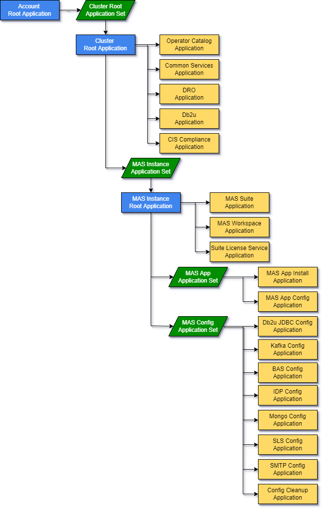
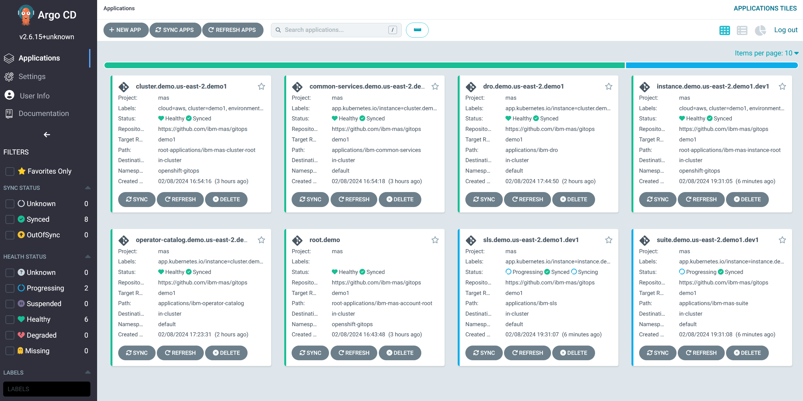

# Maximo Application Suite GitOps Demo

## Overview

During bootstrap we create the **[Account Root Application](https://github.com/ibm-mas/gitops/tree/demo1/root-applications/ibm-mas-account-root)**, this installs the **[Cluster Root Application Set](https://github.com/ibm-mas/gitops/tree/demo1/root-applications/ibm-mas-cluster-root)**.  This is the only ArgoCD application that we directly create on the cluster, all other applications are generated by ArgoCD, following the [App of Apps pattern](https://argo-cd.readthedocs.io/en/stable/operator-manual/cluster-bootstrapping/#app-of-apps-pattern).

TODO: Finish updating this image



TODO: Finish updating this description.
The **Cluster Root Application Set**  generates a **[Cluster Root Application](https://github.com/ibm-mas/gitops/tree/demo1/root-applications/ibm-mas-cluster-root)**. This contains the following Applications:
- [Operator Catalog](https://github.com/ibm-mas/gitops/blob/demo1/root-applications/ibm-mas-cluster-root/templates/ibm-operator-catalog-app.yaml)
- [Common Services](https://github.com/ibm-mas/gitops/blob/demo1/root-applications/ibm-mas-cluster-root/templates/ibm-operator-common-services-app.yaml)
- [DRO](https://github.com/ibm-mas/gitops/blob/demo1/root-applications/ibm-mas-cluster-root/templates/ibm-dro-app.yaml)
- [Db2u](https://github.com/ibm-mas/gitops/blob/demo1/root-applications/ibm-mas-cluster-root/templates/ibm-db2u-app.yaml)
- [CIS Compliance](https://github.com/ibm-mas/gitops/blob/demo1/root-applications/ibm-mas-cluster-root/templates/cis-compliance-app.yaml)

The **Cluster Root Application Set** also includes the **[MAS Instance Application Set](https://github.com/ibm-mas/gitops/blob/demo1/root-applications/ibm-mas-cluster-root/templates/instance-appset.yaml)**, which generates a **[MAS Instance Root Application](https://github.com/ibm-mas/gitops/tree/demo1/root-applications/ibm-mas-instance-root)** containing the following Applications:
- [MAS Suite](https://github.com/ibm-mas/gitops/blob/demo1/root-applications/ibm-mas-instance-root/templates/ibm-mas-suite-app.yaml)
- [MAS Workspace](https://github.com/ibm-mas/gitops/blob/demo1/root-applications/ibm-mas-instance-root/templates/ibm-mas-workspace.yaml)
- [Suite License Service](https://github.com/ibm-mas/gitops/blob/demo1/root-applications/ibm-mas-instance-root/templates/ibm-sls-workspace.yaml)

The **MAS Instance Application** also contains the **[MAS Configurations Application Set](https://github.com/ibm-mas/gitops/blob/demo1/root-applications/ibm-mas-instance-root/templates/configs-appset.yaml)** and **[MAS Applications Application Set](https://github.com/ibm-mas/gitops/blob/demo1/root-applications/ibm-mas-instance-root/templates/masapp-appset.yaml)**:

The **MAS Configurations Application Set**  generates Applications representing the MAS configuration objects, and  a further Application to assist in the ordered uninstall of MAS:
- [MAS Db2u JDBC Configuration](https://github.com/ibm-mas/gitops/blob/demo1/applications/ibm-db2u-jdbc-config)
- [MAS Kafka Configuration](https://github.com/ibm-mas/gitops/blob/demo1/applications/ibm-kafka-config)
- [MAS BAS Configuration](https://github.com/ibm-mas/gitops/blob/demo1/applications/ibm-mas-bas-config)
- [MAS IDP Configuration](https://github.com/ibm-mas/gitops/blob/demo1/applications/ibm-mas-idp-config)
- [MAS Mongo Configuration](https://github.com/ibm-mas/gitops/blob/demo1/applications/ibm-mas-mongo-config)
- [MAS SLS Configuration](https://github.com/ibm-mas/gitops/blob/demo1/applications/ibm-mas-sls-config)
- [MAS SMTP Configuration](https://github.com/ibm-mas/gitops/blob/demo1/applications/ibm-mas-smtp-config)
- [MAS Configuration Cleanup](https://github.com/ibm-mas/gitops/blob/demo1/applications/ibm-mas-config-cleanup)

The **MAS Applications Application Set**  generates two Applications representing the installation and configuration of Maximo applications in the suite:
- [MAS Application Installation](https://github.com/ibm-mas/gitops/blob/demo1/applications/ibm-mas-suite-app-install)
- [MAS Application Configuration](https://github.com/ibm-mas/gitops/blob/demo1/applications/ibm-mas-suite-app-install)


## GitOps with the MAS CLI
We have automated the steps to install MAS via GitOps, you will not need to use the MAS CLI to use our ArgoCD applications, but at this stage of development there is no documentation in place for this.

Note: To access the same version of the MAS CLI used when creating this demo run the following command:

```bash
docker run -ti --pull always quay.io/ibmmas/cli:8.1.0-pre.gitops
```

### Naming Restrictions

**Naming Length Restrictions** Because we stitch together the different IDs that form the hierarchy together we need to ensure that the total length is less than the 64 character limit of ArgoCD applications, to achieve this follow these restrictions when setting values for `--account-id`, -`region-id`, `--cluster-id`, and `--mas-instance-id`:

> TODO: these have changed - only cluster and mas instance ID are now significant.
> TODO: 1 account ID per ArgoCD project.
> TODO: cluster IDs must be unique across all regions in the same account.
- **Account ID**: 8 characters
- **Region ID**: 14 characters
- **Cluster ID**: 7 characters
- **MAS instance ID**: 5 characters

> TODO: we do support multi-project deployments now (root manifest param)
**Why such long application names?** This is primarily due to a limitation we have inherited to be compatible with internal IBM systems where we must have everything under a single ArgoCD project. We would like to support single/multi-project configurations in the long term, but it's not a priority at the moment.

The naming structure in use today is not final, and we do expect to relax these restrictions before the first release.

> TODO: highlight assumption that ArgoCD and MAS live in the same cluster in this demo (although we do support off cluster argocd)

### 1. Provision an OCP Cluster
> TODO: update this
```bash
export IBMCLOUD_APIKEY=xxx
mas provision-roks -r mas-development -c gitopsdemo -v 4.12_openshift --worker-count 3 --worker-flavor b3c.16x64.300gb --worker-zone lon02 --no-confirm
```

When this completed you will be logged into the OCP cluster ready to continue.

### 2. Setup Secrets Manager
Set up [AWS Secrets Manager](https://us-east-2.console.aws.amazon.com/secretsmanager/listsecrets?region=us-east-2), and [create an access key](https://us-east-1.console.aws.amazon.com/iam/home#/security_credentials?section=IAM_credentials)


### 3. Setup common environment variables
> TODO: document the meaning of each section of env vars

The CLI allows arguments to be passed in both via command-line arguments and environment variables. For repeated parameters that are used by many of the functions that we are going to call, we are going to export them as environment variables so we don't have to specify them every time. Please customize the variables below and run the following in your mas-cli terminal session:

```bash
export ACCOUNT_ID="demo"
export CLUSTER_ID="demo2"
export CLUSTER_URL="https://kubernetes.default.svc"


export SM_AWS_REGION="us-east-1"
export SM_AWS_SECRET_ACCESS_KEY="xxx"
export SM_AWS_ACCESS_KEY_ID="xxx"
export SECRETS_PATH="arn:aws:secretsmanager:us-east-1:xxxxxxxxxxxx:secret"
```


### 3. Setup your gitops repository
Git repositories are used to supply ArgoCD with both the **templates** for the MAS installation, as well as a collection of per-cluster/instance **configuration** files used to render those templates into Kubernetes. 

The **templates** are provided by IBM in the public [ibm-mas/gitops](https://github.com/ibm-mas/gitops) repository on github.com. It is recommended that you use this repo (and we will do so in this demonstration), but you are free to fork them into your own git repository if necessary.

For the **configuration** files you will need to setup a new git repository in your preferred provider and supply its details to the CLI via some environment variables. In your mas cli terminal session, run the following, subtituting in the values for your git repository:

```bash
export GITOPS_VERSION="master"
export GITHUB_HOST="github.com"
export GITHUB_ORG="ibm-mas"
export GITHUB_REPO="gitops-demo"
export GIT_BRANCH="002"
export GIT_SSH="false"
```

Create a personal access token in your git provider, ensuring that it has sufficient permissions to read and write from your git repository. Set it in your environment as follows:
```bash
export GITHUB_PAT="xxx"
```

And configure git:
```bash
git config --global user.email "you@example.com"
```


### 3. Bootstrap ArgoCD and create the Account Root Application
> TODO: allow use of an existing ArgoCD? I.e. bootstrap *just* creates the account root appliction?
> TODO: update gitops-bootstrap to allow setting of all new root application parameters
> TODO: test gitops-bootstrap in a blank cluster (can't do this in mas-4)

The `mas gitops-bootstrap` function will perform the following actions:
- Install ArgoCD operator
- Create ArgoCD instance
- Configure Secret Manager backend for ArgoCD
- Configure ArgoCD ServiceAccount and RBAC
- Enable the ArgoCD Vault plugin
- Configure ArgoCD authentication to your application repository using personal access token
- Patch `openshift-marketplace` and `kube-system` namespaces to allow ArgoCD to manage them
- Add `cluster-admin` access to openshift-gitops ServiceAccount (required for managing CecurityContextContraints)
- Create an ArgoCD project for Maximo Application Suite
- Create the Maximo Application Suite **Account Root Application**

```bash

PAT=xxx

mas gitops-bootstrap \
  --account-id "${ACCOUNT_ID}" \
  --app-revision demo1 \
  --sm-aws-secret-region "$REGION_ID" \
  --sm-aws-secret-key $SECRET_KEY \
  --sm-aws-access-key $ACCESS_KEY \
  --github-url https://github.com/ibm-mas/gitops-demo \
  --github-revision 001 \
  --github-pat $PAT
```

You will end up with the root application and a single ApplicationSet deployed in ArgoCD as below:
> TODO: update


Click "Sync" and after a short delay the application will change to "Synced" status:
> TODO: update


This is the only time we will directly make changes on the cluster, with the installation of the **Account Root Application** ArgoCD is ready to automatically deploy all necessary ArgoCD applications as you commit new configuration files to the GitHub configuration repository.

### 4. Generate configuration for the Cluster Root Application
The `mas gitops-cluster` function will perform the following actions:
- Create a new secret in AWS Secrets Manager `${ACCOUNT_ID}/${CLUSTER_ID}/ibm_entitlement` holding the image pull secret for the IBM Container Registry (which contains your IBM entitlement key)
- Create a new secret in AWS Secrets Manager `${ACCOUNT_ID}/${CLUSTER_ID}/aws` holding the access token and secret token for AWS Secrets Manager, which is used by various ArgoCD sync hooks to make updates to secrets
- Generate four new configuration files and push them to your gitops repository
    - `/${ACCOUNT_ID}/${CLUSTER_ID}/ibm-mas-cluster-base.yaml`
    - `/${ACCOUNT_ID}/${CLUSTER_ID}/ibm-common-services.yaml`
    - `/${ACCOUNT_ID}/${CLUSTER_ID}/ibm-mas-cluster-base.yaml`
    - `/${ACCOUNT_ID}/${CLUSTER_ID}/ibm-operator-catalog.yaml`
- The post sync hook in the cert manager application will register two new secrets in AWS Secrets Manager:
    - `${ACCOUNT_ID}/${CLUSTER_ID/db2_default_channel`
    - `${ACCOUNT_ID}/${CLUSTER_ID/cluster_domain`


```bash
ICR_USERNAME="xxx"
ICR_PASSWORD="xxx"

mas gitops-cluster \
  --github-push \
  --icr-username "${ICR_USERNAME}" \
  --icr-password "${ICR_PASSWORD}" \
  --catalog-version v8-240430-amd64 \
  --catalog-image icr.io/cpopen/ibm-maximo-operator-catalog \
  --catalog-action install \
  --common-services-channel v3.23 \
  --common-services-action install
```


Click on the account root application. It will take a few minutes for the cluster root application set to see the new configuration files in your gitops repository. Once this happens, you will see a new cluster root application appear as a child of the cluster application set:


Open the cluster root application by clicking on the button indicated in the screenshot above, the Operator Catalog and cert manager applications will be visible as children of the cluster root application:


The cert manager application will take a little longer to syncronize because it first waits for the Operator Catalog to be ready before installing the cert manager from that catalog. Within 10 minutes all applications should be reporting Healthy and Synced status. 


You can safely proceed with the next steps of this demonstration before this happens if you wish since ArgoCD will take care of orchestrating the deployment, ensuring that applications are only synced once its prerequisites are healthy.


### 5. Generate configuration for DRO
The `mas gitops-dro` function will generate one new configuration file in the GitHub working directory:
- `/${ACCOUNT_ID}/${CLUSTER_ID}/ibm-dro.yaml`

The post sync hook in ibm-dro will register a new secret in AWS Secrets Manager: `${ACCOUNT_ID}/${CLUSTER_ID/dro`

```bash
mas gitops-dro --github-push
```

After a few minutes you should see two new applications appear as children of the cluster root application. The DRO application itself, along with a small "cleanup" application. The cleanup application contains an ArgoCD [PostDelete hook](https://argo-cd.readthedocs.io/en/stable/user-guide/resource_hooks/) necessary to ensure the DRO application is cleaned up properly when its config is deleted from the git repository. 


It should take less than 10 minutes for both of these application to reach Healthy/Synced status. Again, you can safely proceed with the next steps of this demonstration before this happens.


### 5. Generate configuration for the DB2U operator application
Later in this demonsration, we plan to install the Manage application in our MAS instance. Manage depends on a DB2 database, and we are going to deploy this database to our cluster. Before we do this, we must install the DB2U operator:

The `mas gitops-db2u` function will generate one new configuration file in the GitHub working directory:
- `/${ACCOUNT_ID}/${CLUSTER_ID}/ibm-db2u.yaml`


```bash
mas gitops-db2u --github-push
```

After a few minutes you should see a new db2u application appear as a child of the cluster root application.


It should take less than 10 minutes for this application to reach Healthy/Synced status. Again, you can safely proceed with the next steps of this demonstration before this happens.


### 6. Generate configuration for MongoDb
In this example we are going to be using an off-cluster MongoDB instance.  First, create a configuration file in the following format containing the details required to connect to your MongoDb instance:
```yaml
config:
  configDb: admin
  authMechanism: DEFAULT
  retryWrites: true
  hosts:
    - host: host1
      port: 32500
    - host: host2
      port: 32500
    - host: host3
      port: 32500
certificates:
  - alias: ca
    crt: |
      -----BEGIN CERTIFICATE-----
      <certificate body>
      -----END CERTIFICATE-----
```

Running `mas gitops-mongo` will now generate a new secret (`demo/demo1/mongo`)in AWS Secrets Manager holding all the information necessary to connect, which will be used by the IBM Suite License Service and any instances of IBM Maximo Application Suite installed on this cluster.

```bash
SECRET_KEY=xxx
ACCESS_KEY=xxx

USERNAME=xxx
PASSWORD=xxx

mas gitops-mongo \
  -a demo \
  -c demo1 \
  --sm-aws-secret-region us-east-2 \
  --sm-aws-secret-key $SECRET_KEY \
  --sm-aws-access-key $ACCESS_KEY \
  --mongo-provider yaml \
  --yaml-file $MONGO_INFO_YAML_PATH \
  --mongo-username $USERNAME \
  --mongo-password $PASSWORD
```

### 7. Configure MongoDb Account for Maximo Application Suite Core Platform

```bash
SECRET_KEY=xxx
ACCESS_KEY=xxx

USERNAME=xxx
PASSWORD=xxx

aws configure set default.region us-east-2
aws configure set aws_access_key_id $ACCESS_KEY
aws configure set aws_secret_access_key $SECRET_KEY
aws secretsmanager create-secret --name "demo/demo1/dev1/mongo" \
  --secret-string '{"username": "'$USERNAME'", "password": "'$PASSWORD'"}'
```

### 8. Configure License File for Maximo Application Suite Core Platform
```bash
mas gitops-license \
  --account-id ${ACCOUNT_ID} \
  --cluster-id ${CLUSTER_ID} \
  --sm-aws-secret-region us-east-2 \
  --sm-aws-secret-key $SECRET_KEY \
  --sm-aws-access-key $ACCESS_KEY \
  --license-file entitlement.lic
```

This will create another new entry to Secret Manager: `demo/demo1/dev1/license`.  We should now have 8 secrets in total, as below:

```bash
aws secretsmanager list-secrets --output yaml --no-cli-pager | yq -r '.SecretList[].Name' | grep "^demo/demo1" | sort
demo/demo1/aws
demo/demo1/cluster_domain
demo/demo1/db2_default_channel
demo/demo1/dev1/license
demo/demo1/dev1/mongo
demo/demo1/dro
demo/demo1/ibm_entitlement
demo/demo1/mongo
```

### 8. Install Maximo Application Suite Core Platform

```bash
SECRET_KEY=xxx
ACCESS_KEY=xxx
SM_PATH=xxx

DOMAIN=xxx

mas gitops-suite -d /home/david/ibm-mas/gitops-demo \
  --account-id demo \
  --cluster-id demo1 \
  --mas-instance-id dev1 \
  --sm-aws-secret-region us-east-2 \
  --sm-aws-secret-key $SECRET_KEY \
  --sm-aws-access-key $ACCESS_KEY \
  --secrets-path $SM_PATH \
  --mongo-provider yaml \
  --sls-channel 3.x \
  --mas-channel 8.11.x \
  --mas-domain $DOMAIN
```

This will generate three new configuration files:
- [/demo/us-east-2/demo1/dev1/ibm-mas-instance-base.yaml](/demo/us-east-2/demo1/dev1/ibm-mas-instance-base.yaml)
- [/demo/us-east-2/demo1/ibm-mas-suite.yaml](/demo/us-east-2/demo1/dev1/ibm-mas-suite.yaml)
- [/demo/us-east-2/demo1/ibm-sls.yaml](/demo/us-east-2/demo1/dev1/ibm-sls.yaml)

Three new Applications will appear in ArgoCD once you commit these new files to the config repository:
- `instance.demo.us-east-2.demo1.dev1`
- `sls.demo.us-east-2.demo1.dev1`
- `suite.demo.us-east-2.demo1.dev1`



After the Suite License Service application is synched you will find one more entry has been created in Secret Manager, created automatically by it's post sync hook: `demo/demo1/dev1/sls`.

The Suite application will not change to Healthy status until we complete the next step to configure it's connection to DRO, SLS, and MongoDb.

### 9. Configure Maximo Application Suite Core Platform
```bash
SECRET_KEY=xxx
ACCESS_KEY=xxx
SM_PATH=xxx

DRO_URL=$(oc get route ibm-data-reporter -n redhat-marketplace -ojsonpath='{.spec.host}')
oc get secret clusteringresscertificatename -n openshift-ingress -ojsonpath='{.data.tls\.crt}' | base64 -d > dro_ca.crt

mas gitops-suite-config -d /home/david/ibm-mas/gitops-demo \
  --account-id demo \
  --cluster-id demo1 \
  --mas-instance-id dev1 \
  --sm-aws-secret-region us-east-2 \
  --sm-aws-secret-key $SECRET_KEY \
  --sm-aws-access-key $ACCESS_KEY \
  --secrets-path $SM_PATH \
  --mongo-provider yaml \
  --dro-url $DRO_URL \
  --dro-contact-email iotf@uk.ibm.com \
  --dro-contact-firstname David \
  --dro-contact-lastname Parker \
  --dro-ca-certificate-file dro_ca.crt
```

This will generate the 3 configurations that need to be applied to the Core Platform:
- [/demo/us-east-2/demo1/dev1/configs/system.ibm-mas-bas-config.yaml](/demo/us-east-2/demo1/dev1/configs/system.ibm-mas-bas-config.yaml)
- [/demo/us-east-2/demo1/configs/system.ibm-mas-mongo-config.yaml](/demo/us-east-2/demo1/dev1/configs/system.ibm-mas-mongo-config.yaml)
- [/demo/us-east-2/demo1/configs/system.ibm-mas-sls-config.yaml](/demo/us-east-2/demo1/dev1/configs/system.ibm-mas-sls-config.yaml)

Once these three new applications are synced and healthy the Suite application will change to report healthy status as well and you have successfully installed and configured the Maximo Application Suite Core Platform


Finally (for this demo), we create the Workspace to complete the configuration of the Maximo Application Suite Core Platform:

```bash
mas gitops-suite-workspace -d /home/david/ibm-mas/gitops-demo \
  --account-id demo \
  --cluster-id demo1 \
  --mas-instance-id dev1 \
  --mas-workspace-id ws1 \
  --mas-workspace-name "My Workspace" \
  --sm-aws-secret-region us-east-2
```

After committing the generated configuration file, ArgoCD will install the 12th and final ArgoCD Application will appear:


We can review all the secrets created during the install using the command below:
```bash
aws secretsmanager list-secrets --output yaml --no-cli-pager | yq -r '.SecretList[].Name' | grep "^demo/demo1" | sort
```


### 10. Next Steps - Application install

**The MAS ArgoCD applications are in active development, check back later for details on how to install and configure Maximo Applications using GitOps and ArgoCD!**
