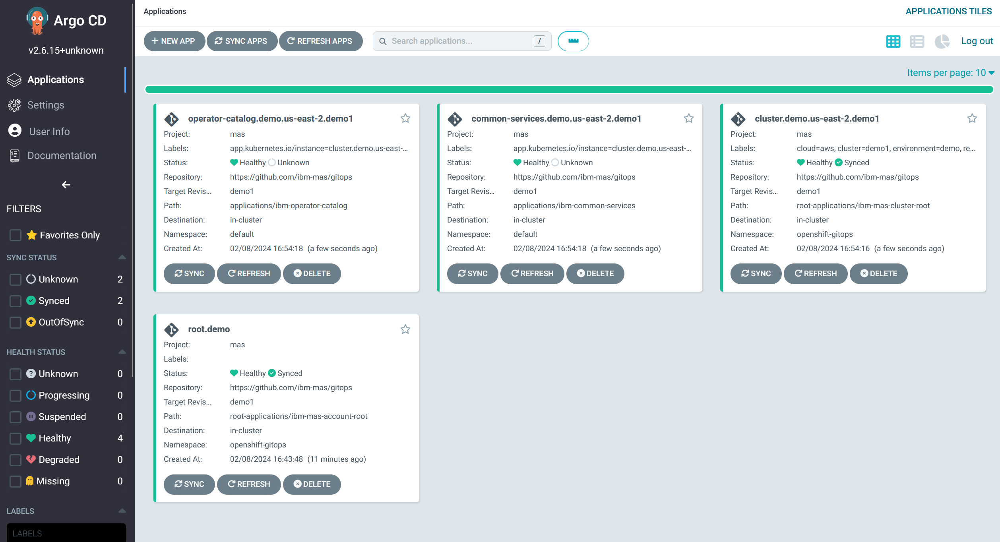

# Maximo Application Suite GitOps Demo

## Overview

During bootstrap we create the **[Account Root Application](https://github.com/ibm-mas/gitops/tree/demo1/root-applications/ibm-mas-account-root)**, this installs the **[Cluster Root Application Set](https://github.com/ibm-mas/gitops/tree/demo1/root-applications/ibm-mas-cluster-root)**.

The **Cluster Root Application Set**  generates a **[Cluster Root Application](https://github.com/ibm-mas/gitops/tree/demo1/root-applications/ibm-mas-cluster-root)** for each cluster in the account. This contains the following Applications:
- [Operator Catalog](https://github.com/ibm-mas/gitops/blob/demo1/root-applications/ibm-mas-cluster-root/templates/ibm-operator-catalog-app.yaml)
- [Common Services](https://github.com/ibm-mas/gitops/blob/demo1/root-applications/ibm-mas-cluster-root/templates/ibm-operator-common-services-app.yaml)
- [DRO](https://github.com/ibm-mas/gitops/blob/demo1/root-applications/ibm-mas-cluster-root/templates/ibm-dro-app.yaml)
- [Db2u](https://github.com/ibm-mas/gitops/blob/demo1/root-applications/ibm-mas-cluster-root/templates/ibm-db2u-app.yaml)
- [CIS Compliance](https://github.com/ibm-mas/gitops/blob/demo1/root-applications/ibm-mas-cluster-root/templates/cis-compliance-app.yaml)

The **Cluster Root Application Set** also contains the **MAS Instance Application Set**
- [MAS Instance](https://github.com/ibm-mas/gitops/blob/demo1/root-applications/ibm-mas-cluster-root/templates/instance-appset.yaml)

The **MAS Instance Application Set** contains .... (work in progress)


## GitOps with the MAS CLI
We have automated the steps to install MAS via GitOps, you do not need to use the CLI, but the same basic process must be followed.

### 1. Provision an OCP Cluster
```bash
export IBMCLOUD_APIKEY=xxx
mas provision-roks -r mas-development -c gitopsdemo -v 4.12_openshift --worker-count 3 --worker-flavor b3c.16x64.300gb --worker-zone lon02 --no-confirm
```

When this completed you will be logged into the OCP cluster ready to continue.

### 2. Setup Secrets Manager
Set up [AWS Secrets Manager](https://us-east-2.console.aws.amazon.com/secretsmanager/listsecrets?region=us-east-2), and [create an access key](https://us-east-1.console.aws.amazon.com/iam/home#/security_credentials?section=IAM_credentials)


### 3. Bootstrap ArgoCD and create the Account Root Application
- Install ArgoCD operator
- Create ArgoCD instance
- Configure Secret Manager backend for ArgoCD
- Configure ArgoCD ServiceAccount and RBAC
- Enable the ArgoCD Vault plugin
- Configure ArgoCD authentication to your application repository using personal access token
- Patch `openshift-marketplace` and `kube-system` namespaces to allow ArgoCD to manage them
- Add `cluster-admin` access to openshift-gitops ServiceAccount (required for managing CecurityContextContraints)
- Create an ArgoCD project for Maximo Application Suite
- Create the Maximo Application Suite **Account Root Application**

```bash
SECRET_KEY=xxx
ACCESS_KEY=xxx
PAT=xxx

mas gitops-bootstrap \
  --account-id demo \
  --app-revision demo1 \
  --sm-aws-secret-region us-east-2 \
  --sm-aws-secret-key $SECRET_KEY \
  --sm-aws-access-key $ACCESS_KEY \
  --github-url https://github.com/ibm-mas/gitops-demo \
  --github-revision 001 \
  --github-pat $PAT
```
You will end up with the root application and a single ApplicationSet deployed in ArgoCD as below:


Click "Sync" and after a short delay the application will change to "Synced" status:


### 4. Generate configuration for the Cluster Root Application
- Create a new secret in AWS Secrets Manager `demo/demo1/ibm_entitlement` holding the image pull secret for the IBM Container Registry (which contains your IBM entitlement key)
- Create a new secret in AWS Secrets Manager `demo/demo1/aws` holding the access token and secret token for AWS Secrets Manager, which is used by various ArgoCD sync hooks to make updates to secrets
- Generate three new configuration files in the GitHub working directory:
    - [/demo/us-east-2/demo1/ibm-common-services.yaml](/demo/us-east-2/demo1/ibm-common-services.yaml)
    - [/demo/us-east-2/demo1/ibm-mas-cluster-base.yaml](/demo/us-east-2/demo1/ibm-mas-cluster-base.yaml)
    - [/demo/us-east-2/demo1/ibm-operator-catalog.yaml](/demo/us-east-2/demo1/ibm-operator-catalog.yaml)
- The post sync hook in ibm-common-services will register two new secrets in AWS Secrets Manager:
    - `demo/demo1/db2_default_channel`
    - `demo/demo1/cluster_domain`

```bash
USERNAME=xxx
PASSWORD=xxx
SECRET_KEY=xxx
ACCESS_KEY=xxx
SM_PATH=xxx

mas gitops-cluster -d /home/david/ibm-mas/gitops-demo \
  --account-id demo \
  --cluster-id demo1 \
  --icr-username $USER \
  --icr-password $PASSWORD \
  --sm-aws-secret-region us-east-2 \
  --sm-aws-secret-key $SECRET_KEY \
  --sm-aws-access-key $ACCESS_KEY \
  --secrets-path $SM_PATH \
  --catalog-version v8-240130-amd64 \
  --catalog-image icr.io/cpopen/ibm-maximo-operator-catalog \
  --catalog-action install \
  --common-services-channel v3.23 \
  --common-services-action install
```

You must now push these changes to the branch specified when you bootstrapped ArgoCD (in this case `001`), as soon as you do this you will see three new applications generated in ArgoCD as below:



The IBM Common Services and Operator Catalog applications will be visible as childen of the cluster application set


The Common Services application will take a little longer to syncronize because it first waits for the Operator Catalog to be ready before installing IBM Common Services from that catalog.

Within 10 minutes all applications should be reporting Healthy and Synced status.


### 5. Generate configuration for DRO
- Generate one new configuration file in the GitHub working directory:
    - [/demo/us-east-2/demo1/ibm-dro.yaml](/demo/us-east-2/demo1/ibm-dro.yaml)
- The post sync hook in ibm-dro will register a new secret in AWS Secrets Manager: `demo/demo1/dro`

```bash
SECRET_KEY=xxx
ACCESS_KEY=xxx
SM_PATH=xxx

mas gitops-dro -d /home/david/ibm-mas/gitops-demo \
  --account-id demo \
  --cluster-id demo1 \
  --sm-aws-secret-region us-east-2 \
  --sm-aws-secret-key $SECRET_KEY \
  --sm-aws-access-key $ACCESS_KEY \
  --secrets-path $SM_PATH
```

You must now push this change to your branch, as soon as you do this you will see the new application generated in ArgoCD as below, it should take less than 10 minutes for this application to reach Healthy/Synced status:


### 6. Generate configuration for MongoDb
In this example we are going to be using an off-cluster MongoDB instance.  First, create a configuration file in the following format containing the details required to connect to your MongoDb instance:
```yaml
config:
  configDb: admin
  authMechanism: DEFAULT
  retryWrites: true
  hosts:
    - host: host1
      port: 32500
    - host: host2
      port: 32500
    - host: host3
      port: 32500
certificates:
  - alias: ca
    crt: |
      -----BEGIN CERTIFICATE-----
      <certificate body>
      -----END CERTIFICATE-----
```

Running `mas gitops-mongo` will now generate a new secret (`demo/demo1/mongo`)in AWS Secrets Manager holding all the information necessary to connect, which will be used by the IBM Suite License Service and any instances of IBM Maximo Application Suite installed on this cluster.

```bash
SECRET_KEY=xxx
ACCESS_KEY=xxx

USERNAME=xxx
PASSWORD=xxx

mas gitops-mongo \
  -a demo \
  -c demo1 \
  --sm-aws-secret-region us-east-2 \
  --sm-aws-secret-key $SECRET_KEY \
  --sm-aws-access-key $ACCESS_KEY \
  --mongo-provider yaml \
  --yaml-file $MONGO_INFO_YAML_PATH \
  --mongo-username $USERNAME \
  --mongo-password $PASSWORD
```

### 7. Configure MongoDb Account for Maximo Application Suite Core Platform

```bash
SECRET_KEY=xxx
ACCESS_KEY=xxx

USERNAME=xxx
PASSWORD=xxx

aws configure set default.region us-east-2
aws configure set aws_access_key_id $ACCESS_KEY
aws configure set aws_secret_access_key $SECRET_KEY
aws secretsmanager create-secret --name "demo/demo1/dev1/mongo" \
  --secret-string '{"username": "'$USERNAME'", "password": "'$PASSWORD'"}'
```

### 8. Configure License File for Maximo Application Suite Core Platform
```bash
mas gitops-license \
  --account-id $ACCOUNT_ID \
  --cluster-id $CLUSTER_ID \
  --sm-aws-secret-region us-east-2 \
  --sm-aws-secret-key $SECRET_KEY \
  --sm-aws-access-key $ACCESS_KEY \
  --license-file entitlement.lic
```

This will create another new entry to Secret Manager: `demo/demo1/dev1/license`.  We should now have 8 secrets in total, as below:

```bash
aws secretsmanager list-secrets --output yaml --no-cli-pager | yq -r '.SecretList[].Name' | grep "^demo/demo1" | sort
demo/demo1/aws
demo/demo1/cluster_domain
demo/demo1/db2_default_channel
demo/demo1/dev1/license
demo/demo1/dev1/mongo
demo/demo1/dro
demo/demo1/ibm_entitlement
demo/demo1/mongo
```

### 8. Install Maximo Application Suite Core Platform

```bash
SECRET_KEY=xxx
ACCESS_KEY=xxx
SM_PATH=xxx

DOMAIN=xxx

mas gitops-suite -d /home/david/ibm-mas/gitops-demo \
  --account-id demo \
  --cluster-id demo1 \
  --mas-instance-id dev1 \
  --sm-aws-secret-region us-east-2 \
  --sm-aws-secret-key $SECRET_KEY \
  --sm-aws-access-key $ACCESS_KEY \
  --secrets-path $SM_PATH \
  --mongo-provider yaml \
  --sls-channel 3.x \
  --mas-channel 8.11.x \
  --mas-domain $DOMAIN
```
This will generate three new configuration files:
    - [/demo/us-east-2/demo1/dev1/ibm-mas-instance-base.yaml](/demo/us-east-2/demo1/dev1/ibm-mas-instance-base.yaml)
    - [/demo/us-east-2/demo1/ibm-mas-suite.yaml](/demo/us-east-2/demo1/dev1/ibm-mas-suite.yaml)
    - [/demo/us-east-2/demo1/ibm-sls.yaml](/demo/us-east-2/demo1/dev1/ibm-sls.yaml)

Three new Applications will appear in ArgoCD once you commit these new files to the config repository:
- `instance.demo.us-east-2.demo1.dev1`
- `sls.demo.us-east-2.demo1.dev1`
- `suite.demo.us-east-2.demo1.dev1`


After the Suite License Service application is synched you will find one more entry has been created in Secret Manager, created automatically by it's post sync hook: `demo/demo1/dev1/sls`.

The Suite application will not change to Healthy status until we complete the next step to configure it's connection to DRO, SLS, and MongoDb.

### 9. Configure Maximo Application Suite Core Platform
```bash
SECRET_KEY=xxx
ACCESS_KEY=xxx
SM_PATH=xxx

DRO_URL=$(oc get route ibm-data-reporter -n redhat-marketplace -ojsonpath='{.spec.host}')
oc get secret clusteringresscertificatename -n openshift-ingress -ojsonpath='{.data.tls\.crt}' | base64 -d > dro_ca.crt

mas gitops-suite-config -d /home/david/ibm-mas/gitops-demo \
  --account-id demo \
  --cluster-id demo1 \
  --mas-instance-id dev1 \
  --sm-aws-secret-region us-east-2 \
  --sm-aws-secret-key $SECRET_KEY \
  --sm-aws-access-key $ACCESS_KEY \
  --secrets-path $SM_PATH \
  --mongo-provider yaml \
  --dro-url $DRO_URL \
  --dro-contact-email iotf@uk.ibm.com \
  --dro-contact-firstname David \
  --dro-contact-lastname Parker \
  --dro-ca-certificate-file dro_ca.crt
```

This will generate the 3 configurations that need to be applied to the Core Platform:
- [/demo/us-east-2/demo1/dev1/configs/system.ibm-mas-bas-config.yaml](/demo/us-east-2/demo1/dev1/configs/system.ibm-mas-bas-config.yaml)
- [/demo/us-east-2/demo1/configs/system.ibm-mas-mongo-config.yaml](/demo/us-east-2/demo1/dev1/configs/system.ibm-mas-mongo-config.yaml)
- [/demo/us-east-2/demo1/configs/system.ibm-mas-sls-config.yaml](/demo/us-east-2/demo1/dev1/configs/system.ibm-mas-sls-config.yaml)

Once these three new applications are synced and healthy the Suite application will change to report healthy status as well and you have successfully installed and configured the Maximo Application Suite Core Platform


### 10. Next Steps - Application install
This is still in active development, check back later for details on how to install and configure Maximo Applications using GitOps and ArgoCD.

## Useful Commands

### Secrets Manager: List All Secrets
```bash
aws secretsmanager list-secrets --output yaml --no-cli-pager | yq -r '.SecretList[].Name' | grep "^demo/demo1" | sort
```
